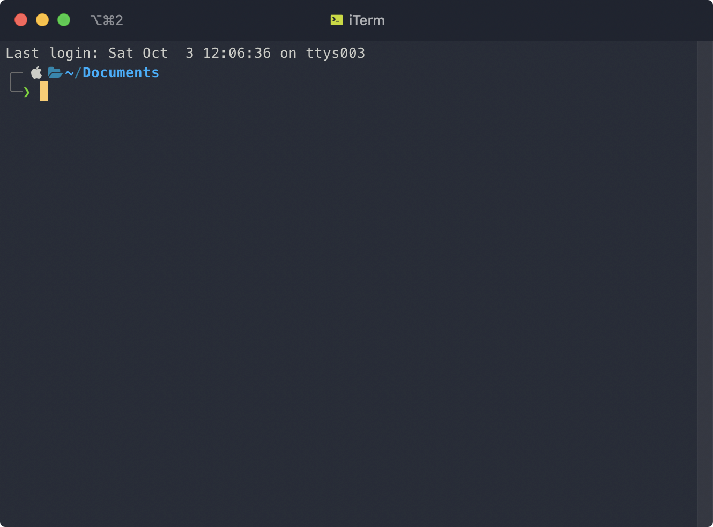
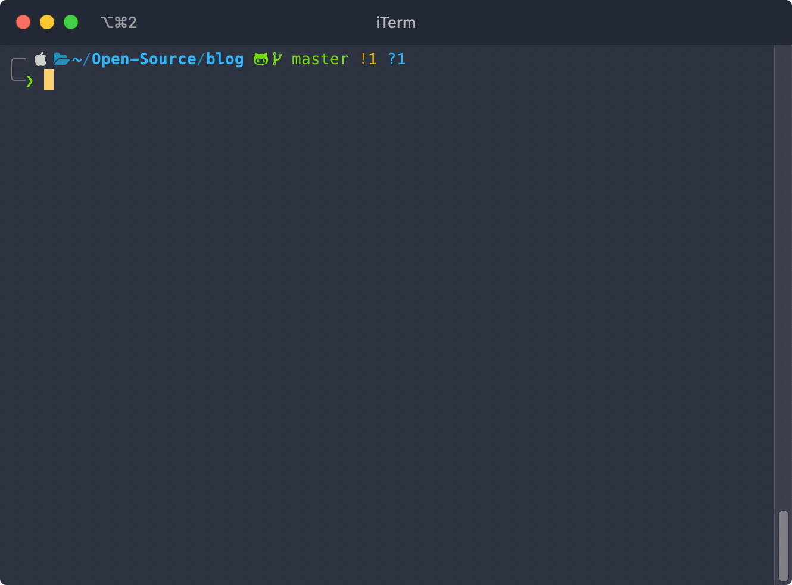
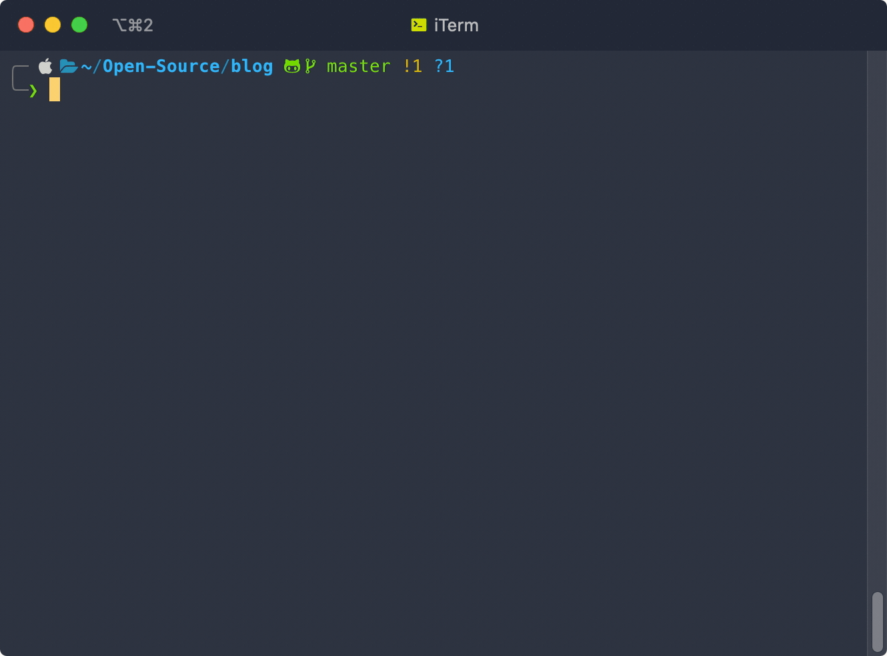
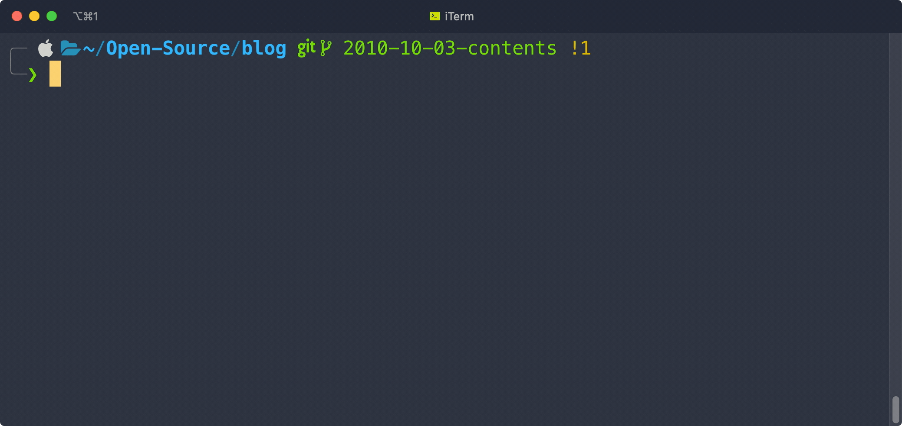
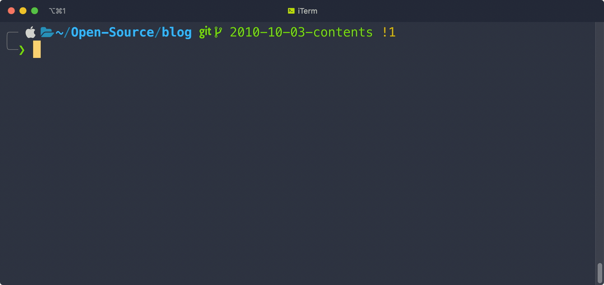

Halo, disini mau sharing beberapa tips di command line yang saya pakai sehari-hari.
Tips yang pengen tak bagikan di sini lebih ke sharing plugin-plugin yang bisa di install di terminal kalian ya.. Niscaya, dengan sharing plugin-plugin yang saya pakai di sini semoga bisa berguna dan membantu hidup kamu 😀

## iTerm

Hampir tiap hari saya pakai command line di kerjaan saya, entah itu buat ngejalanin perintah git, install node dependencies, ngejalanin npm scripts, dan lain-lain. Karena kebetulan saya pake Mac, Terminal bawaan dari Mac tidak cukup bikin saya puas karena kustomisasi yang tersedia cukup sedikit.

Jadi buat ngegantinya, saya install iTerm karena iTerm ini punya banyak opsi yang bisa di kustomisasi, contohnya seperti shortcut, tema, dan banyak pengaturan lain yang bisa kita atur sesuai keinginan kita. Yaa, sebenernya gak banyak sih yang saya kustomisasi di iTerm, tapi karena saya udah terbiasa pake ini dari dulu, jadi belum coba alternatif terminal yang lain.


<p align="center"><small><i>Gambar 1: Penampakan iTerm</i></small></p>

Tapi ini sharing aja ya, saya gak bilang kamu harus pake iTerm 😀

## [Thefuck](https://github.com/nvbn/thefuck)

Plugin yang pertama yaitu thefuck, ini adalah plugin terminal terlucu yang saya tau. Btw saya tau plugin ini pertama kali dari [om Mul](https://github.com/mul14) 😀

Pasti sering kan kita tiap mau ngejalanin perintah di CLI itu typo. Misal :

- `git status` malah jadi `git stats`
- `yarn` jadi `yan`
- `git log` malah jadi `git lig` 😅
- Atau kasus lain misal mau ngejalanin perintah tertentu ternyata harus pake perintah `sudo`, misal `rm -rf my-folder` gak bisa dan harus pake `sudo` didepannya, jadinya kita harus ngulangin nulisin perintah kita jadi `sudo rm -rf my-folder`.

Cukup _annoying_ bukan?

Nah si [thefuck](https://github.com/nvbn/thefuck) ini ngebantu kita buat ngebenerin typo atau hal lain. Penggunaanya cukup simpel, tiap kali kita gagal ngejalanin suatu perintah, kita tinggal tulis `fuck`, maka perintahnya jalan 😅


<p align="center"><small><i>Gambar 2: thefuck in action</i></small></p>

Kalo kamu perhatikan di video di atas, thefuck masih akan nanya ke kita terlebih dahulu tentang perintah yang kita maksud sebelum dia eksekusi. Jika kita oke, maka kita cukup tekan Enter.
Kalo kita lagi frustasi dan lagi sensitif dan gak pengen ditanya-tanya, kita cukup ketikkan perintah `fuck --yeah` dan thefuck gak bakal nanya kekita terlebih dahulu dan dia langsung akan eksekusi perintah yang dia rasa benar.


<p align="center"><small><i>Gambar 3: fuck yeah!</i></small></p>

## [Oh-My-ZSH](https://github.com/ohmyZSH/ohmyZSH)

Buat temen-temen yang mungkin perlu buat dibantu hidupnya, dan thefuck tadi nggak cukup membantu, bisa cobain install ZSH (dibaca _zishel_).

Jadi dengan ZSH, ada banyak banget plugin yang bisa kita pasang, tapi untungnya ada satu framework buat ZSH buat nge-_manage_ konfigurasi ZSH, yang namanya Oh-My-Zsh.
Jadi, ketika Oh-my-ZSH ini kita install, kita bakal dapet banyak banget plugin sama tema ZSH yang tinggal kita aktifin doang di konfigurasinya, jadi gak perlu download-download lagi.

Konon katanya, orang kalo udah pake oh-my-ZSH trus tau plugin2 nya yg keren bakal ngomong "Oh My Ziii"


<p align="center"><small><i>Gambar 4: Oh My Zii</i></small></p>

Kamu bisa install Oh-My-ZSH [di sini](https://github.com/ohmyzsh/ohmyzsh), Tapi ingat ya Oh-My-ZSH ini tuh semacam framework buat ZSH, jadi kamu perlu install dulu ZSH nya [di sini](https://github.com/ohmyzsh/ohmyzsh/wiki/Installing-ZSH)

Untuk bisa dapet momen _oh my zii_-mu sendiri, kamu harus nyobain sendiri plugin yang ada. Kamu bisa lihat daftar plugin yang dia sediakan [di sini](https://github.com/ohmyzsh/ohmyzsh/wiki/Plugins)

## Plugins Oh-My-ZSH

Kalo kamu sudah lihat plugin yang Oh-My-ZSH sediakan, pasti ada banyak banget sampe bikin kita pusing milih yang mana 😅 Disini, saya mau tunjukin beberapa plugins yang saya pakai dengan harapan kamu terbantu juga dengan adanya plugin yang sering saya pakai

### Git

Nah, plugin OMZ yang sering banget aku pake itu Git , setelah kita pasang Git di OMZ, kita bisa jalanin perintah git dengan lebih singkat karena plugin ini ngasih kita kumpulan perintah shortcut.

Berikut beberapa contoh shortcut yang saya maksud :

- `gst` → `git status`
- `glo` → `git log --oneline`
- `gb` → `git branch`
- `gcmsg "pesan commit"` → `git commit -m "pesan commit"`
- `gcb "nama branch"` → `git checkout -b "nama branch"`
- `gco "nama branch"` → `git checkout "nama branch"`

Dan masih banyak lagi, kamu bisa lihat shortcut lengkapnya dan juga cara install pluginnya [di sini](https://github.com/ohmyzsh/ohmyzsh/tree/master/plugins/git)


<p align="center"><small><i>Gambar 5: Git Plugin in action</i></small></p>

### Yarn & Composer

Karena saya kerjaan saya sehari hari berhubungan dengan node package dan sedikit composer package. Plugin yarn & composer ini kurang lebih sama dengan Git, dia sudah nyediain shortcut-shortcut yang bisa kita pakai.

#### Yarn

- `y` → `yarn`
- `yd` → `yarn dev`
- `yt` → `yarn test`
- `yb` → `yarn build`
- `yad nama-package` → `yarn add -D nama-package`
- `yup nama-package` → `yarn upgrade nama-package`

#### Composer

- `c` → `composer`
- `ci nama-package` → `composer install nama-package`

Kamu bisa lihat shortcut lengkapnya dan juga cara install plugin yarn [di sini](https://github.com/ohmyzsh/ohmyzsh/tree/master/plugins/git)
dan composer [di sini](https://github.com/ohmyzsh/ohmyzsh/tree/master/plugins/composer).


<p align="center"><small><i>Gambar 6: Yarn in action</i></small></p>

### Alias-Finder

Sekarang kita udah tau kalo dengan nginstall plugin-plugin di atas kita bisa dapet shortcut dari perintah yang biasanya kita ketik panjang.

Karena shortcut nya itu banyak banget, dan kalo ngehapalin shortcut satu-satu pastinya kita males dong, akhirnya shortcutnya gak dipake karena males ngapalin semuanya sekaligus..

Trus gimana caranya kita bisa hafal? Nah, dengan alias-finder ini kita bisa cari tau alias yang udah kita daftarin. Dengan adanya alias-finder ini kita bisa hafal dengan shortcut-shortcut di atas seiring berjalannya waktu.

Misal kita mau checkout ke sebuah branch tapi lupa apa shortcutnya, kita tinggal ketik `alias-finder -l` di ikuti perintah yang kita cari.


<p align="center"><small><i>Gambar 7: Alias-finder in action</i></small></p>

**Tips**: Kalo kamu rasa perintah `alias-finder -l` masih terlalu panjang, kita bisa modifikasi sedikit supaya lebih singkat.

Buka file konfigurasi ZSH dengan cara ketik perintah `nano ~/.zshrc`, trus tambahin perintah berikut didalamnya:

```shell
alias af="alias-finder -l"
```

Jangan lupa reload konfigurasimu dengan perintah `source ~/.zshrc`. Sekarang kamu cukup ketik perintah `af git status` buat nyari shortcut dari git status.

Kamu bisa lihat shortcut lengkapnya dan juga cara install plugin yarn [di sini](https://github.com/ohmyzsh/ohmyzsh/tree/master/plugins/git)

### Interactive CD

### Autojump

### ZSH-Autosuggestions

### ZSH-Syntax-Highlighting
