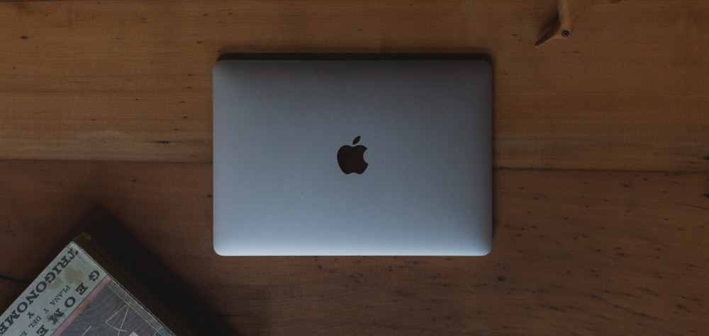

<p align="center"><small><span>Photo by <a href="https://unsplash.com/@basico?utm_source=unsplash&utm_medium=referral&utm_content=creditCopyText" target="_blank" rel="noopener">Gustavo Espindola</a></span></small></p>

## Table Of Contents

```toc

```

## Preface

> Artikel ini merupakan dokumentasi hidup, artinya ketika saya pakai sesuatu yang baru atau perlu saya tambahkan maka artikel ini bakal saya update juga.

Sampai saat tulisan ini ditulis, saya belum tau cara setup aplikasi, konfigurasi, dan tools buat development yang sering saya pakai di Macbook secara cepat. Beberapa kali saya kesulitan ketika harus pegang Macbook yang dalam keadaan fresh sesuai kebutuhan saya. Entah itu dapet fasilitas dari kantor, habis direset, maupun Macbook baru.

Bahkan pernah saya butuh seharian buat konfigurasi semua yang saya butuhkan, sehingga tidak bisa langsung produktif. Tiap udah ngerasa semuanya komplit, pas kerja ternyata ada yang kurang dan akhirnya kerjaan keganggu karena harus lanjut setup lagi biar kerjanya nyaman.

Artikel ini saya bikin sebagai catatan supaya lebih mudah ketika harus setup ulang nantinya. Karena saya seorang web developer, kebanyakan aplikasi dan konfigurasi yang saya lakukan disini bakal seputar JavaScript / NodeJS. Jadi, kalau kamu seseorang yang profesinya sama dengan saya, semoga artikel ini bisa jadi catatanmu juga.

<p align="center">. &nbsp; . &nbsp; .</p>

## Homebrew

Install [Homebrew](https://brew.sh/) sebagai package manager di Mac. Cara install Homebrew cukup jelas di websitenya.

```shell{promptUser: tri}
/bin/bash -c "$(curl -fsSL https://raw.githubusercontent.com/Homebrew/install/master/install.sh)"
```

<p align="center">. &nbsp; . &nbsp; .</p>

## Aplikasi

Berikut aplikasi yang selalu saya install:

| Program                                                        | Fungsi                     |
| -------------------------------------------------------------- | -------------------------- |
| [Visual Studio Code](https://code.visualstudio.com/)           | Code Editor                |
| [Google Chrome](https://www.google.com/chrome/)                | Web Browser                |
| [iTerm2](https://www.iterm2.com/downloads.html)                | Alternatif Terminal Bawaan |
| [Docker](https://www.docker.com/products/docker-desktop)       | Environment Tool           |
| [Slack](https://slack.com/downloads)                           | Komunikasi                 |
| [Spotify](https://www.spotify.com/id/download/mac/b/)          | Musik                      |
| [Postman](https://www.postman.com/downloads/)                  | API Tool                   |
| [Notion](https://www.notion.so/desktop)                        | Aplikasi Catatan           |
| [Sequel Pro](https://sequelpro.com/download)                   | Database UI                |
| [Gifox](https://gifox.io/)                                     | Gif Recorder               |
| [ImageOptim](https://imageoptim.com/mac)                       | Image Compressor           |
| [Rectangle](https://rectangleapp.com/)                         | Resize Window Tool         |
| [Git](https://git-scm.com/download/mac)                        | Version Control            |
| [Yarn](https://classic.yarnpkg.com/en/docs/install#mac-stable) | Node Package Manager       |
| [Logi Options](https://www.logitech.com/en-us/product/options) | Logitech Mouse App         |

### Install Otomatis

Setelah Homebrew terinstall, saya bisa install semua aplikasi yang saya butuhkan via Homebrew secara otomatis.

```shell{promptUser: tri}
brew install git yarn && brew install --cask visual-studio-code google-chrome iterm2 docker slack spotify postman notion sequel-pro gifox imageoptim rectangle
```

### Install Manual

Karena gak semua aplikasi tersedia di Homebrew Cask secara _default_, jadi harus install sendiri.

- Logi Options: https://www.logitech.com/en-us/product/options

## Shell

Saya terbiasa pakai [Zsh](https://github.com/ohmyzsh/ohmyzsh/wiki/Installing-ZSH) sebagai Shell utama, untungnya karena MacOS Catalina sudah include Zsh sebagai _default_ Shell. Jadi tinggal install [Oh My Zsh](https://ohmyz.sh/) aja supaya semua plugin yang saya butuhkan langsung terinstall.

```shell{promptUser: tri}
sh -c "$(curl -fsSL https://raw.github.com/ohmyzsh/ohmyzsh/master/tools/install.sh)"
```

Catatan Plugin favorit apa saja yang sering saya pakai sudah pernah saya tulis di artikel [Koding Lebih Produktif dengan Plugin Terminal](/koding-lebih-produktif-dengan-plugin-terminal/)

## Node.js

Saya memilih buat install Node.js via Node Version Manager (NVM) supaya bisa ganti-ganti versi dengan mudah, karena sering kali saya perlu ganti ke Node versi lama maupun ke Node versi baru.

### Install NVM

```shell{promptUser: tri}
curl -o- https://raw.githubusercontent.com/nvm-sh/nvm/v0.36.0/install.sh | bash
```

### Install Node Terbaru

```shell{promptUser: tri}
nvm install node
```

### Ganti Versi Node

```shell{promptUser: tri}
nvm install xx.xx && nvm use xx.xx
```

Lalu set yang barusan di install sebagai _default_

```shell{promptUser: tri}
nvm alias default xx.xx
```

## Git

Setelah Git terinstall, pastikan atur profil di konfigurasi global

```shell{promptUser: tri}
git config --global user.name "Nama Lengkap" && git config --global user.email "alamatemail@mail.com"
```

## System Preferences

_Bagian ini kembali ke selera masing-masing._

### General

- Set Google Chrome sebagai _default browser_

### Dock

- Disable "Show recent application in Dock" supaya jumlah dock konsisten
- Sesuaikan Size Dock jadi lebih kecil karena size \_default_nya menurut saya kebesaran

### Accessibility

- Atur Pointer Control > Trackpad Options > Enable draging (Three finger drag) supaya bisa drag-n-drop pakai tiga jari.

### Trackpad

- Centang "Tap to click"

### Keyboard

Walaupun bahasa yang saya pakai di Mac Bahasa Inggris, saya harus memastikan pengaturan berikut mati supaya tiap kali menulis kata Bahasa Indonesia, Mac gak berusaha ngubah jadi suatu kata yang dia rasa benar.

- Disable "Correct spelling automatically"
- Disable "Capitalize words automatically"
- Disable "Add period with double-space"
- Disable "Use smart quotes and dashes"

## Misc

Pengaturan lain

### Cara cepat akses screenshots

1. Bikin folder bernama "Screenshots" di Desktop
2. Tekan tombol `Cmd` + `Shift` + `5`. Trus klik "Options" > "Other Location"
3. Pilih Folder yang udah dibikin di step 1
4. Tekan tombol `Esc` buat keluar dari screenshot setting
5. Buka Finder, cari folder "Screenshots" di Desktop, trus drag folder nya ke Dock
6. Posisi foldernya udah di Dock, klik kanan di foldernya trus centang "Fan" di bagian "view content as" & centang "Name" di bagian "sort by"

<video autoplay loop muted playsinline width="100%">
  <source src="accessing-screenshots-faster.webm" type="video/webm">
  <source src="accessing-screenshots-faster.mp4" type="video/mp4">
</video>
<p align="center"><small><i>Gambar 1: Akses screenshot dengan cepat</i></small></p>
