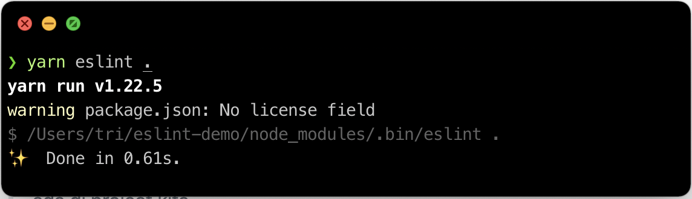

<p align="center"><small><span>Photo by <a href='https://www.freepik.com/vectors/school'>upklyak</a></span></small></p>

## Table Of Contents

```toc

```

## Preface

Static Testing digunakan untuk memvalidasi penulisan kode yang telah kita tulis. Contoh validasi yang saya maksud adalah seperti _typo_, variabel yang tidak terpakai, kode yang gak direkomendasikan buat dipakai, dll.
Untuk menerapkan Static Testing di Javascript, kita perlu menyiapkan seperti apa aturan-aturan yang akan kita pakai di kode kita.

<p align="center">. &nbsp; . &nbsp; .</p><br />

## Eslint

Salah satu _tool_ populer yang dapat kita pakai untuk menerapkan Static Testing adalah <a href="https://eslint.org/docs/user-guide/getting-started" target="_blank" rel="noopener">Eslint</a>.

Eslint adalah sebuah _tool_ untuk mengidentifikasi dan melaporkan ketika ada kode yang melanggar aturan-aturan tertentu. Tujuan dari penggunaan Eslint adalah membuat _source code_ menjadi lebih konsisten dan menghindari _bugs_.

### Instalasi Eslint

Untuk dapat menggunakan Eslint, kita harus menginstall dulu Eslint di aplikasi kita melalui terminal.

> Saya menggunakan Yarn sebagai package manager pengganti NPM. Kamu bisa tetap menggunakan NPM kalau belum install Yarn. Perbedaan perintah NPM dan Yarn bisa di lihat <a href="https://www.digitalocean.com/community/tutorials/nodejs-npm-yarn-cheatsheet">di sini</a>.

```shell
yarn add --dev eslint
```

### Membuat Konfigurasi Eslint

Selanjutnya, kita perlu membuat file konfigurasi yang berisi aturan-aturan untuk kode kita. Kita cukup menjalankan perintah berikut untuk membuat file konfigurasinya:

```shell
yarn eslint --init
```

Begitu kita menjalankan perintah di atas, akan muncul beberapa pertanyaan dari Eslint. Di pertanyaan pertama, kamu bisa pilih _"To check syntax and find problems"_.


<p align="center"><small><i>Gambar 1: Yarn Init - Pertanyaan pertama</i></small></p>

Pertanyaan kedua, pilih sesuai dengan tipe _module_ apa yang kamu gunakan. Saya memilih _"None of these"_ untuk keperluan demo kali ini.


<p align="center"><small><i>Gambar 2: Yarn Init - Pertanyaan kedua</i></small></p>

Sisa pertanyaan lainnya bisa dilihat di _screenshot_ berikut (kamu bebas mengatur sesuai kebutuhanmu):


<p align="center"><small><i>Gambar 3: Yarn Init - Rekap Jawaban</i></small></p>

Sampai di sini kita bakal dapet file bernama **.eslintrc.json** secara otomatis, dan isi filenya kurang lebih seperti berikut:

```json:title=.eslintrc.json
{
  "env": {
    "browser": true,
    "es2021": true
  },
  "extends": "eslint:recommended",
  "parserOptions": {
    "ecmaVersion": 12
  },
  "rules": {}
}
```

### Menjalankan Eslint

Sampai di sini, kita harus punya setidaknya satu file Javascript buat dicek oleh Eslint. Di sini saya membuat file bernama **demo.js** dengan kode simpel seperti berikut:

```js:title=demo.js
var king = "Bran Stark";

console.log(king);
```

Setelah itu kita bisa coba jalankan Eslint di terminal:

```shell
yarn eslint .
```

> Tanda . (titik) berarti kita menyuruh Eslint memindai semua file yang ada di project kita.


<p align="center"><small><i>Gambar 4: Eslint Bersih. Tidak ada laporan error</i></small></p>

### Menambahkan Aturan di Eslint

Untuk menambahkan aturan, buka file **.eslintrc.json**, lalu tambahkan aturan/_rule_ nya ke dalam _property_ **rules**.

Saya akan coba menambahkan `"no-console": "warn"`.

```json:title=.eslintrc.json
{
  "env": {
    "browser": true,
    "es2021": true
  },
  "extends": "eslint:recommended",
  "parserOptions": {
    "ecmaVersion": 12
  },
  "rules": {
    // highlight-next-line
    "no-console": "warn"
  }
}
```

Ketika `yarn eslint .` dijalankan lagi, bakalan akan ada _warning_ dari Eslint.


<p align="center"><small><i>Gambar 5: Eslint Bersih. Tidak ada laporan error</i></small></p>

Seperti yang diharapkan, kita telah menyuruh Eslint memberikan _warning_ ke kita jika ada `console.log` di dalam kode kita, melalui `"no-console": "warn"`.

Selain **warn**, ada juga **error** (tanda error) dan **off** (mematikan _rule_).

> Untuk melihat apa aja _rules_ yang tersedia, bisa dibaca <a href="https://eslint.org/docs/rules/" target="_blank" rel="noopener">di sini</a>

### Eslint di VSCode

Menjalankan perintah `yarn eslint .` secara berulang-ulang setiap kali kita mengubah kode kita tentu akan membosankan bukan? Nah, supaya kita bisa mengetahui secara _realtime_ kesalahan di kode kita, kita bisa memanfaatkan <a href="https://marketplace.visualstudio.com/items?itemName=dbaeumer.vscode-eslint" target="_blank" rel="noopener">Ekstensi Eslint</a> dari VSCode.

Setelah kita menginstall Ekstensi Eslint di VSCode, setiap ada kode yang salah akan digaris bawahi oleh ekstensi ini.


<p align="center"><small><i>Gambar 6: Ekstensi Eslint di VSCode</i></small></p>

### Menggunakan aturan yang sudah disediakan

Sampai di sini, kode **demo.js** mempunyai satu _warning_, yaitu gak boleh ada `console.log` di dalamnya. Tapi, ketika saya hapus perintah `console.log` nya, malah muncul _warning_ lain.


<p align="center"><small><i>Gambar 7: Variabel tidak terpakai</i></small></p>

Padahal kita cuma punya `"no-console": "warn"` di file **eslintrc.json**, kenapa Eslint bisa melaporkan warning itu?

Jawabannya, karena `"extends": "eslint:recommended"` ada di file **.eslintrc.json**

```json:title=.eslintrc.json
{
  "env": {
    "browser": true,
    "es2021": true
  },
  // highlight-next-line
  "extends": "eslint:recommended",
  ...
}
```

Apa itu **extends** di Eslint?

Mengatur aturan-aturan di _property_ **rules** pastinya membosankan bukan? Apalagi kalau kita mengerjakan project yang banyak dan harus membuat **rules** terus menerus. Untuk itu, Eslint menyediakan kumpulan aturan-aturan yang bisa langsung kita pakai melalui _property_ **extends**. Dengan begini kita gak harus mengatur semua _rules_ sendiri.

> Klik <a href="https://eslint.org/docs/rules/" target="_blank" rel="noopener">di sini</a>, untuk melihat apa saja pengaturan yang disedikan oleh **eslint:recommended** (di tandai dengan tanda ✔).

> Apapun yang kita definisikan di **rules** bakal menimpa aturan dari **extends** , sehingga kita masih punya kontrol mengatur aturan kita sendiri kalau ada aturan dari **extends** yang gak cocok sama preferensi kita.

### Fitur Auto Fix Eslint

Kita bisa menyuruh Eslint untuk memperbaiki semua _warning_/_error_ yang ada secara otomatis dengan menambahkan `--fix` saat menjalankan Eslint.

```shell
yarn eslint . --fix
```

Namun tidak semua kesalahan bisa di perbaiki secara otomatis. Kita bisa melihat apa saja yang mampu diperbaiki oleh Eslint secara otomatis dengan melihat yang bertanda "🔧" di website <a href="https://eslint.org/docs/rules/" target="_blank" rel="noopener">Eslint Rules</a>.

Fitur Auto Fix Eslint bisa juga dijalankan di VSCode dengan menekan tombol `CTRL + Shift + P` (di Windows) atau `CMD + Shift + P` (di Mac), lalu cari dan pilih _Eslint: Fix all auto-fixable Problems_.


<p align="center"><small><i>Gambar 8: Autofix Eslint di VSCode</i></small></p>

### Mengabaikan file di Eslinit

Beberapa file mungkin tidak perlu diolah oleh Eslint, misalnya hasil _build_ atau direktori _node_modules_, dll karena bukan ranah kita mengatur file di direktori tersebut. Untuk itu kita bisa membuat file **.eslintignore** dan isi dengan direktori atau file apa saja yang mau diabaikan.

Cara kerjanya sangat mirip dengan **.gitignore** di Git.

Oh ya, kita bisa memanfaatkan file **.gitignore** daripada membuat file **.eslintignore**. Caranya dengan menambahkan option `--ignore-path` ketika menjalankan Eslint.

```shell
yarn eslint --ignore-path .gitignore .
```

<p align="center">. &nbsp; . &nbsp; .</p><br />

## Prettier

Saat kita ngoding, salah satu hal yang paling membosankan adalah merapikan kode kita, misalnya Tab yang kurang rapi, spasi yang kebanyakan, bingung antara mau pakai petik satu atau petik dua buat string, dll.

Untuk mengotomatisasi hal ini, kita bisa memanfaatkan <a href="https://prettier.io/" target="_blank" rel="noopener">Prettier</a>.

Dengan memakai Prettier, kita cukup fokus membuat aplikasi kita saja dan gak perlu pusing-pusing apakah kode penulisan kita rapi atau tidak karena hal tersebut sudah ditangani Prettier.

### Instalasi dan Konfigurasi

```shell
yarn add --dev prettier
```

Untuk mencoba mem-format kode suatu file, jalankan perintah berikut:

```shell
yarn prettier demo.js
```

Menjalankan perintah di atas cuma akan menampilkan hasil yang sudah di format di terminal saja. Untuk memformat file dan sekaligus kodenya, tambahkan `--write`.

```shell
yarn prettier demo.js --write
```

Kita juga bisa menyuruh Prettier untuk memformat semua file di project kita dengan tanda . (titik)

```shell
yarn prettier . --write
```

Bahkan kamu juga bisa pakai Regex untuk memilih apa saja file yang kita mau supaya ditangani oleh Prettier.

```shell
yarn prettier \"**/*.+(js|json)\" --write
```

Sama seperti Eslint, kita bisa menambahkan `--ignore-path` buat mengabaikan kode yang gak perlu di format

```shell
yarn prettier --ignore-path node_modules \"**/*.+(js|json)\" --write
```

dan memanfaatkan **.gitignore** seperti yang kita lakukan di Eslint.

```shell
yarn prettier --ignore-path .gitignore \"**/*.+(js|json)\" --write
```

Kita juga bisa mengatur bagaimana Prettier memformat kode kita dengan cara membuat file bernama **.prettierrc**

Untuk memudahkan, buka [https://prettier.io/playground/](https://prettier.io/playground/) lalu klik "Show Options". Disitu bakal ada opsi yang bisa kita atur sesuai preferensi kita. Setelah nemu yang cocok, klik "Copy config JSON" lalu paste ke file **.prettierrc**

### Prettier di VSCode

VSCode juga punya ekstensi buat Prettier! Kamu tinggal install [ekstensinya](https://marketplace.visualstudio.com/items?itemName=esbenp.prettier-vscode), lalu buka file **settings.json** di VSCode.

Selanjutnya, pastikan kamu menambahkan dua pengaturan berikut:


```json:title=settings.json
{
  "editor.defaultFormatter": "esbenp.pretter-vscode",
  "editor.formatOnSave": true
}
```

Sekarang, tiap kali kita save file yang sedang kita edit, VScode Prettier bakal ngeformat file kita secara otomatis ✨

<p align="center">. &nbsp; . &nbsp; .</p><br />

## Prettier dan Eslint Bertengkar

Karena pengaturan eslint dan prettier berbeda, terkadang beberapa aturan bisa saling bertengkar.

Misalnya di Eslint kita set supaya `comma-dangle` menampilkan error, tapi di Prettier kita set `trailingComma: es5`

Hal ini bisa bikin frustasi karena setiap kita membetulkan error yang muncul di Eslint, Prettier membalikannya lagi karena kita udah set `formatOnSave` di VSCode. Dan mereka akan saling rebutan saat memformat kode kita.

<video autoplay loop muted playsinline width="100%">
  <source src="images/war.webm" type="video/webm">
  <source src="images/war.mp4" type="video/mp4">
</video>
<p align="center"><small><i>Gambar 9: Ilustrasi pertengkaran konfigurasi Eslint dan Prettier</i></small></p

Solusinya adalah dengan menginstall [eslint-config-prettier](https://github.com/prettier/eslint-config-prettier)

```shell
yarn add --dev eslint-config-prettier
```

Selanjutnya, kita tinggal tambahkan bagian `extends` di file **.eslintrc.json**

```json:title=.eslintrc.json
{
  "extends": ["some-other-config-you-use", "prettier"]
}
```

> "prettier" merupakan singkatan dari "eslint-config-prettier"

Cara kerja plugin ini adalah, dia bakal mematikan semua peraturan _error_/_warning_ yang telah di-extends, sehingga Eslint akan mengalah.

Karena plugin ini cara kerjanya menimpa peraturan yang telah di-extends, maka wajib di taruh di array terakhir.

Kalau meng-extends suatu plugin, disarankan juga menambahkan `prettier/plugin-tersebut` (kalau tersedia). Contohnya:

```json:title=.eslintrc.json
{
  "extends": ["airbnb", "prettier", "prettier/react"]
}
```

kode di atas meng-extend plugin [_eslint-config-airbnb_](https://www.npmjs.com/package/eslint-config-airbnb). Nah supaya Eslint & Prettier gak bertabrakan lagi, kita include kan juga _prettier/react_.

<p align="center">. &nbsp; . &nbsp; .</p><br />

## Membuat scripts

Perintah-perintah terminal di atas akan lebih mudah kalau kita tambahkan _scripts_ di file **package.json** supaya lebih singkat tiap kali mau ngejalaninnya.

```json:title=package.json
{
  "scripts": {
    "lint": "eslint --ignore-path .gitignore .",
    "prettier": "prettier --ignore-path .gitignore \"**/*.+(js|json)\"",
    "format": "yarn prettier --write",
    "check-format": "yarn prettier --check",
    "validate": "yarn lint && yarn check-format"
  }
}
```

Dengan begini, tiap kali kita mau memastikan apakah semua kode kita sudah terformat dan mengikuti aturan Eslint dan Prettier, kita tinggal jalanin perintah `yarn validate`.

> Penggunaan perintah `yarn validate` yang mengkombinasikan Eslint dan Prettier untuk memindai semua file sangat sempurna diletakkan di Pipeline Continuous Integration

<p align="center">. &nbsp; . &nbsp; .</p><br />

## Husky

Pada project besar yang dikerjakan banyak orang, terkadang akan susah mengontrol semua orang untuk menggunakan Eslint dan Prettier.

Entah karena ada orang yang gak menginstall ekstensi Prettier / Eslint jadi gak tau kalau ada kode yang menyalahi aturan, atau mungkin sengaja gak nginstall ekstensinya tapi lupa ngejalanin perintah Eslint dan Prettier di Terminal.

Untuk itu, kita bisa memanfaatkan <a href="https://www.npmjs.com/package/husky" target="_blank" rel="noopener">Husky</a> untuk menjalankan perintah Eslint dan Prettier tiap kali ada commit baru yang akan masuk di Git.

Kamu bisa menginstall <a href="https://www.npmjs.com/package/husky" target="_blank" rel="noopener">Husky</a> dengan menjalankan perintah berikut:

```shell
yarn add --dev husky
```

Lalu, buat sebuah file bernama **.huskyrc** dan isi dengan konten berikut:

```json:title=.huskyrc
{
  "hooks": {
    "pre-commit": "yarn validate"
  }
}
```

Sekarang, tiap kali kita mau commit sesuatu di Git, perintah `yarn validate` akan selalu dijalankan. Jika ada satu baris saja yang menyalahi aturan, commit bakal gagal dijalankan. Jadi, developer terkait harus membetulkan kode yang menyalahi aturan tersebut, setelah itu coba commit ulang.

<p align="center">. &nbsp; . &nbsp; .</p><br />

## Lint-staged

Di titik ini, tiap kali kita mau commit sesuatu dan ada kode yang gak terformat dengan benar atau gak lolos cek, maka commit akan gagal. Dengan begini, kode di aplikasi kita bisa terjamin akan selalu mengikuti aturan-aturan yang telah ditetapkan di Eslint dan Prettier.

Walaupun bagus, di perspektif developer ini bisa sangat mengganggu. Bayangkan saja kamu mengedit file A dan B lalu temanmu si Jon mengedit file C dan D.

File C dan D yang ditulis Jon belum rapi dan telah ter-commit tanpa mengikuti aturan di Eslint dan Prettier kita (Salah satu kemungkinannya, si Jon melakukan commit tepat sebelum konfigurasi Eslint dan Prettier dibuat).

Nah, kamu yang kebetulan melakukan perubahan di file A dan B setelah konfigurasi Eslint dan Prettier dibuat, jadi harus bertanggung jawab mengurusi file C dan D nya si Jon, karena perintah `yarn validate` akan memindai semua file.

Gimana caranya, supaya kamu cuma perlu mengurusi kode yang kamu ubah saja (file A dan B) ?

<a href="https://github.com/okonet/lint-staged" target="_blank" rel="noopener">Lint-Staged</a> hadir sebagai solusi untuk masalah ini ✨

Install dulu Lint-Staged via terminal:

```shell
yarn add --dev lint-staged
```

Lalu, buat file bernama **.lintstagedrc** dan isi dengan konten berikut:

```json:title=.lintstagedrc
{
  "*.js": ["eslint --fix", "prettier --write", "git add"]
}
```

Lalu update file **.huskyrc**

```json:title=.huskyrc
{
  "hooks": {
    "pre-commit": "lint-staged"
  }
}
```

Kode di atas berarti, kita ingin menjalankan perintah `eslint --fix` dan `prettier --write` ke setiap file ber-ekstensi **js**, tapi **cuma yang berada di staging area Git**.

Dengan begini, semua perubahan yang telah dilakukan dan akan di commit, bakal terformat secara otomatis. Sekarang semua orang yang bahkan belum install Eslint dan Prettier di editor mereka pun kodenya bakal bersih ketika di commit.

## Penutup

Semua konfigurasi yang saya lakukan di atas bisa dilihat di [Repository ini](https://github.com/trihargianto/static-testing-javascript-demo).

Apakah kamu punya teknik lain yang lebih keren untuk melakukan static testing di Javascript? Jika iya, silahkan _sharing_ juga di kolom komentar di bawah ya 👌.

Terimakasih sudah membaca.
