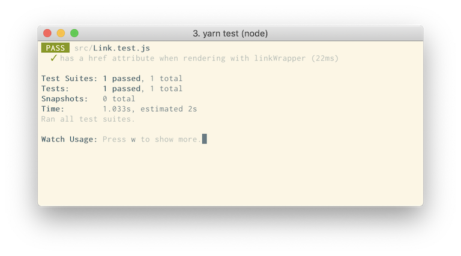

<p align="center"><small><span>Design by <a href='https://medium.com/mamikos-design'>Mamikos Design Team</a></span></small></p>

> Tulisan saya di sini ditulis dari perspektif saya sebagai developer, karena UI designer sudah jelas punya masalah dan proeses yang berbeda. Selain itu saya juga belum melakukan interview ke UI designer, hehe.

## Table Of Contents

```toc

```

## Alasan dibuatnya Design System

Kalau kamu seorang Front-End Engineer, kamu pastinya sadar kalau kita sekarang berada di era komponen. Sekarang semuanya serba komponen karena memang dengan memecah UI menjadi komponen yang kecil-kecil, memudahkan kita dalam menyusun sebuah UI yang lebih besar.

Konsep komponen inilah yang tim Mamikos terapkan dari tahun 2016 sampai sekarang, dimana dalam implementasinya mempercayakan [VueJS](https://vuejs.org/) karena lebih mudah diaplikasikan ke project yang sudah ada, dan _learning curve_ yang lebih rendah daripada _framework_ sejenis seperti [React](https://reactjs.org/).

Sampai tulisan ini ditulis, kami masih nyaman dengan UI berbasis komponen, karena komponen yang sudah dibuat bisa dipakai berulang-ulang.

Masalah datang ketika tim di Mamikos makin banyak, dipecah menjadi beberapa _squad_, dan project baru bermunculan. Bahkan, sekarang kurang lebih ada 6 project berbeda yang dikerjakan tim yang berbeda.

Konsep re-usable komponen yang harusnya bisa memudahkan pekerjaan pun tidak bekerja secara maksimal, bahkan sekarang ada 6 komponen _button_ yang punya tampilan yang sama. Karena memang komponen nya hidup di tiap project.

Masalah yang lain, ketika project A udah punya komponen X, trus ternyata project B, C, dan D butuh komponen yang sama, maka project-project itu harus bikin komponennya dari awal / copy paste dari project A.

Selain itu, ketika ada perubahan UI, susah sekali mengatur semua project buat dapet perubahan UI yang sama.

<p align="center">. &nbsp; . &nbsp; .</p><br />

## Design System Sebagai Solusi

Di pertengahan tahun 2020, kami memutuskan buat membangun sebuah Design System sendiri, dengan harapan kami bisa punya _single source of truth_ buat tiap komponen, UI yang lebih konsisten, dan mengurangi membuat komponen yang sama berulang-ulang.

Setelah melalui beberapa proses, kami memberi nama Design System kami dengan nama **Bantal Guling** karena memang bantal dan guling identik dengan anak kos.

Lalu, karena Engineer gak mau nama _library_ nya kepanjangan, maka kami singkat jadi **BanGul** 😅

<p align="center">. &nbsp; . &nbsp; .</p><br />

## Principles


<p align="center"><small><i>Gambar 1: Principles Illustration</i></small></p>

Sebelum memulai men-_develop_ Design System, hal yang pertama kali kami lakukan adalah menentukan _principle_ developer BanGul dulu.

Kenapa membuat _principle_ menjadi prioritas pertama kami? Karena tanpa _principle_ yang jelas, tiap developer yang ikut mengembangkan BanGul bakal punya _mindset_ sendiri tentang bagaimana mereka harus mengembangkan BanGul.

Berikut ini beberapa _principle_ yang kami pakai dan harus ada di kepala setiap developer BanGul:

> Kami membuat _principle_ ini berdasarkan interview ke beberapa frontend developer di Mamikos, sehingga _principle_ yang kami buat memang relevan dengan masalah yang mereka alami.

### Fokus ke kebutuhan developer

Kami ingin supaya developer yang pakai library BanGul nanti nyaman ketika pakai BanGul buat mengembangkan produk Mamikos, entah itu ketika pertama kali pakai, ataupun kesekian kalinya.

Nyaman disini artinya, kami harus berusaha supaya BanGul mudah dipakai tapi fitur tiap komponen tetap lengkap. Selain itu kami juga harus selalu memprioritaskan komponen yang memang dibutuhkan terlebih dahulu.

### Stabil dan konsisten

Kami juga harus berusaha memastikan BanGul stabil dan _pattern_ tiap komponen selalu konsisten. Karena kalau BanGul sendiri gak stabil, gak ada developer di Mamikos yang mau pakai dan akhirnya mereka bikin komponen mereka sendiri-sendiri.

### Mempercepat development

Kami juga harus memastikan komponen yang dibikin nanti memang bisa mempercepat pekerjaan temen-temen engineer yang lain, jadi mereka bisa fokus ke fitur yang dikerjakan dan gak perlu memikirkan untuk membuat komponen yang sudah BanGul sediakan.

<p align="center">. &nbsp; . &nbsp; .</p><br />

## Pemilihan Teknologi


<p align="center"><small><i>Gambar 2: Ilustrasi Pemilihan Teknologi</i></small></p>

Setelah kami punya principles yang jelas, kami juga harus menentukan teknologi apa aja yang dipakai untuk membangun BanGul. Cara kami memilih teknologinya dibagi jadi dua tahap:

### Teknologi yang familiar

Sebagai informasi, tim yang bertugas mengerjakan BanGul adalah tim Core Front-End saja (termasuk saya). Tapi, walaupun yang mengerjakan dari Core Team, kami ingin supaya kedepannya teman-teman dari tim lain bisa berkontribusi mengembangkan BanGul.

Membuka kesempatan bagi teman-teman yang lain supaya bisa berkontribusi artinya kami harus memastikan BanGul mempunyai _learning curve_ yang rendah. Jadi, teman-teman yang lain harusnya cukup pakai ilmu yang sudah mereka tau buat bisa ikut berkontribusi.

Supaya hal ini bisa ter-realisasi, kami harus memakai teknologi dan arsitektur yang kami semua cukup familiar dan pakai di Mamikos. Untuk itu, kami harus memetakan apa saja library, framework, arsitektur, dan gimana struktur komponen di semua project Mamikos, lalu memilah mana saja yang paling banyak digunakan. Dari hasil pilah-pilah itu lah teknologi yang dipakai ditentukan.

### Me-riset project lain

Setelah tau teknologi apa aja yang mau kita pakai di BanGul. Kami masih perlu meriset lagi bagaimana sebuah UI library/framework pada umumnya dibangun dengan melihat beberapa project Open Source seperti Polaris, Pajama, Primer-React, dan lain-lain. 

Step ini juga penting kami lakukan karena ini pertama kalinya kami membuat sebuah UI framework.

Di sini kami melakukan riset ke beberapa framework populer yang arsitekturnya mendekati dengan arsitekturnya project Mamikos dan lalu kami jadikan referensi ketika proses development.

<p align="center">. &nbsp; . &nbsp; .</p><br />

## Development

Proses development komponen-komponennya sendiri cukup standar, sesama developer BanGul akan melakukan Code Review antara satu sama lain untuk tiap komponen yang selesai dibikin.

<p align="center">. &nbsp; . &nbsp; .</p><br />

## Testing

Untuk memastikan library BanGul stabil dan sesuai dengan design yang sudah dibikin oleh Designer, kami menerapkan beberapa metode testing:

1. Visual Testing
2. Unit Testing
3. Manual Testing (Validasi design oleh Designer)

<br />

### Visual Testing

Jenis test yang pertama kami pakai adalah Visual Testing. Kami ingin supaya perubahan pada kode yang kami lakukan gak menyebabkan perubahan tampilan yang gak diinginkan.

Cara kerja Visual Testing adalah meng-capture semua komponen yang telah kami buat menjadi berupa kumpulan gambar.

Selanjutnya, ketika kami melakukan perubahan kode, lalu test runner dijalankan, ia akan meng-capture semua komponen menjadi kumpulan gambar lagi dan membandingkan semua gambarnya dengan yang sudah di capture sebelumnya.

Dengan begini kami bisa tau semua perubahan yang terjadi, dari perubahan yang disengaja dan tak disengaja.

<video autoplay loop muted playsinline width="100%" style="margin-top: -32px;">
  <source src="component-visual-testing.webm" type="video/webm">
  <source src="component-visual-testing.mp4" type="video/mp4">
</video>
<p align="center"><small><i>Gambar 3: Visual Testing</i></small></p>

Kenapa ini penting? Karena kami membuat lebih dari 40 komponen dan tentu kami gak akan sanggup secara manual selalu memastikan semua baik-baik saja tiap ada perubahan kode.

### Unit Testing

Tujuan Unit Testing ini buat memverifikasi tingkah laku tiap komponen. Tingkah laku di sini contohnya seperti ketika kita melakukan interaksi ke komponen misalnya klik, hover, focus, dll.

Selain itu, dengan unit testing juga bisa melakukan test ke logic internal tiap komponen.


<p align="center"><small><i>Gambar 4: Unit Testing</i></small></p>
<br />

### Validasi Design

Selain test yang bersifat otomatis seperti di atas, kami juga meminta _approval_ dari Designer untuk memastikan komponen yang kami buat sudah sesuai design.

<p align="center">. &nbsp; . &nbsp; .</p><br />

## Dokumentasi

Komponen yang udah dibikin bakal susah dipakai tanpa adanya dokumen yang jelas. Jadi, sudah pasti kalau bagian ini merupakan bagian yang sangat penting.

Menurut kami, beberapa poin yang harus ada di sebuah dokumentasi yaitu:

1. Cara install dan cara upgrade BanGul
2. Cara pakai dan _property_ apa aja yang tersedia di tiap komponen


<p align="center"><small><i>Gambar 5: Property yang disediakan</i></small></p>

3. Variasi yang tersedia di tiap komponen


<p align="center"><small><i>Gambar 6: Variasi Komponen Button</i></small></p>
<br />

4. Transparansi informasi tiap adanya penambahan dan perubahan fitur via Release Note / Changelog.

5. Satu halaman interaktif khusus tiap komponen. Kami menyebutnya “playground”.

<video autoplay loop muted playsinline width="100%">
  <source src="demo-button-playground.webm" type="video/webm">
  <source src="demo-button-playground.mp4" type="video/mp4">
</video>
<p align="center"><small><i>Gambar 7: Demo Playground</i></small></p>

<br />

Perkara dokumentasi ini sebenarnya juga bukan hal yang simpel untuk dibikin, karena kami harus memperbarui dokumentasi setiap ada komponen yang update.

Untungnya untuk hal ini, kami cukup dimudahkan karena kami memilih [Storybook](https://storybook.js.org/) untuk membuat dokumentasinya.

<p align="center">. &nbsp; . &nbsp; .</p><br />

## Design Sync Meetup


<p align="center"><small><i>Gambar 8: Design Sync Meetup</i></small></p>
<br />

Tentunya, design yang udah dibikin UI Designer bukan design yang sekali jadi, tapi designnya akan selalu ada perubahan karena memang menyesuaikan kebutuhan bisnis Mamikos.

Selain itu, Design System yang dibangun juga melibatkan banyak pihak, seperti UI designer, Android Developer, iOS Developer, Web Frontend Developer, bahkan Engineering Manager.

Dengan kombinasi tim antar role seperti ini akan cukup sulit menjaga kami semua tetap tetap di satu pemahaman yang sama untuk tiap komponennya, terlebih lagi jika ada update design. Karenanya, kami berinisiatif mengadakan _meeting_ mingguan yang bertujuan untuk diskusi dan update _progress_ tiap tim seminggu sekali dan biasanya meeting ini berlangsung kurang lebih 2jam.

<p align="center">. &nbsp; . &nbsp; .</p><br />

## Merilis Library

Kami membuat jadwal rilis fitur baru tiap dua minggu sekali jika memang ada fitur baru atau update design dari designer. Selain itu, metode versioning yang kami pakai menggunakan [Semantic Versioning](https://semver.org/), karena kami lihat ini sudah cukup efektif buat tim kami.

<p align="center">. &nbsp; . &nbsp; .</p><br />

## Apa yang saya pelajari

Dari yang saya pelajari, komunikasi merupakan hal yang sangat krusial ketika membangun Design System. Membangun Design System bukanlah perkara mudah karena melibatkan banyak pihak dalam pembuatannya, oleh karena itu salah satu kunci suksesnya sebuah Design System adalah **komunikasi**.

Buruknya komunikasi dan gagalnya menyatukan pemahaman di tiap pihak bisa berdampak tidak terpakainya komponen atau bahkan Design System yang sudah dibuat.

Tentu, Design System Bantal Guling jauh dari kata sempurna, mungkin ada beberapa proses yang kurang atau mungkin tidak efektif. Tapi, Saya dan tim Design System Mamikos belajar banyak dari proses ini dan berusaha membenahi apa-apa saja yang bisa ditingkatkan.

<p align="center">. &nbsp; . &nbsp; .</p><br />

Terimakasih sudah membaca, semoga tulisan ini bermanfaat.