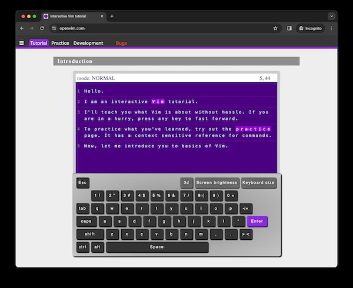
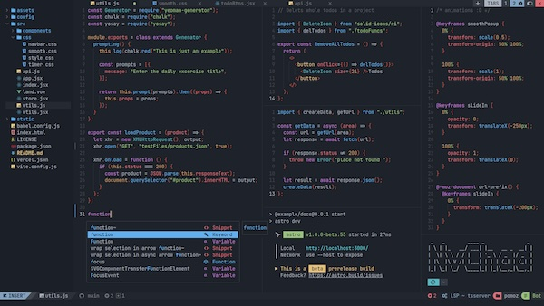

<p align="center"><small><span>Original Photo by <a href="https://unsplash.com/photos/macbook-pro-on-top-of-brown-table-1SAnrIxw5OY" target="_blank" rel="noopener">Kari Shea</a></span></small></p>

## Table of Contents

```toc

```

## Background

"[Vim](https://www.vim.org/)", suatu aplikasi teks editor yang sangat menantang
bagi saya. Saya ingat pertama kali nyobain Vim, rasanya sangat ribet. Terlebih
bagi saya sebagai orang yang ngoding pertama kali cuma pake
[Notepad++](https://notepad-plus-plus.org/downloads/).

Bagaimana tidak, mau nulis kode aja harus mikir dulu, padahal nulis kode aja
udah mikir. Double mikir kan jadinya 😂

Begini kurang lebih gambarannya:

- Kalau mau buka Vim, harus masuk Terminal trus ketik `vim` atau
  `vim nama-file.js`.
- Ketika udah kebuka, yang ada cuma layar hitam. Gak ada menu "New file",
  "Save", "Undo", "Redo", dll.
- Sampai di layar hitam ini, saya pikir bisa nulis. Ternyata masih belum bisa,
  mencet-mencet tombol di keyboard nampak gak ada respon. Sampai akhirnya mencet
  tombol `i`. Baru deh bisa nulis sesuatu.
- Setelah nulis sesuatu, mulai bingung lagi. Tombol "Save" nya gak ada, tombol
  "Exit" gak ada. Setelah _googling_ ternyata harus mencet tombol "Esc", trus
  ketik `:wq`.
- Waktu itu langsung jadi pengalaman pertama dan terakhir kali pakai Vim karena
  ngerasa bukannya nambah produktif malah ngurangin produktif.


Beberapa tahun berlalu, entah di internet atau di meetup offline
[JogjaJS](https://jogja.js.org/), saya sering lihat orang pakai Vim, saya juga
sesekali ngintip ekosistem open source nya di
[Github](https://github.com/search?q=vim&type=repositories) juga ternyata memang
cukup aktif.

Akhirnya terbesit di pikiran saya:

> Gak masuk akal rasanya orang-orang tetep pake Vim kalau memang sangat
> merepotkan dan menghambat produktivitas seperti yang saya rasakan

Saya akhirnya membuat komitmen untuk selalu memakai Vim ketika memang tidak ada
deadline atau di waktu luang, misalnya ketika ngerjain
[Pet Projects](/projects). Alasannya:

- Mencoba sekali lagi, untuk membuktikan apakah sebenernya pake Vim itu bikin
  produktif atau malah sebaliknya.
- Mencari suasana ngoding baru selain pake
  [VSCode](https://code.visualstudio.com/).
- Yang terakhir biar keliatan keren aja, karena liat satu
  [channel di Youtube](https://www.youtube.com/watch?v=fFHlfbKVi30) pake Vim 😆

## Fase 1: Kenalan Basic Commands

Untuk fase pertama ini saya mencoba mencari tahu cara pakai Vim itu sebenernya
seperti apa. Di fase ini saya belajar Vim basic commands melalui situs
[openvim.com](https://www.openvim.com/). Situs ini sangat saya rekomendasikan ke
kalian yang berminat belajar Vim juga karena cukup interaktif.



Walaupun gak hafal semua perintah, paling gak udah bisa masukin teks, simpan
file, dan paham dikit apa itu Command Mode, Visual Mode, Insert Mode, dll.

## Fase 2: Pakai VSCodeVim

Setelah tahu cara pakai Vim dikit-dikit, saya gak langsung nyemplung pake native
Vim di Terminal, melainkan pakai Plugin
[VSCodeVim](https://marketplace.visualstudio.com/items?itemName=vscodevim.vim),
yang memungkinkan kita merasakan pengalaman pakai Vim tapi tetap di environment
VSCode. Saya sudah pakai VSCodeVim ini kurang lebih 6 bulan dan saya rasa ini
sangat sempurna untuk berlatih membiasakan memakai Vim karena menjadi jembatan
antara VSCode dan Vim.


## Fase 3: Pakai zsh-vi-mode di Terminal

[zsh-vi-mode](https://github.com/jeffreytse/zsh-vi-mode) ini fungsinya supaya
kita bisa merasakan pakai Vim di Prompt Terminal. Jadi misal kita punya command
yang panjang, navigasi teks jauh lebih mudah dengan plugin ini.

<p class="flex justify-center">
    <video autoplay loop muted playsinline style="max-width: 600px">
      <source src="images/zsh-vi-mode.webm" type="video/webm">
      <source src="images/zsh-vi-mode.mp4" type="video/mp4">
    </video>
</p>

Selain VSCodeVim, plugin ini lumayan bikin saya terbiasa dengan Vim. Patut
dicoba 👍

## Fase 4: Pakai NvChad

[NvChad](https://nvchad.com/) adalah salah satu Vim Distribution yang cukup
populer. "Distribution" di sini maksudnya adalah Vim dengan paket lengkap. Sudah
terinstall banyak plugin Vim yang tinggal pakai sehingga tampilannya mendekati
teks editor desktop lain seperti VSCode.



Selain NvChad, ada juga Vim Distribution yang lain, misalnya
[LunarVim](https://www.lunarvim.org/) dan [AstroVim](https://astronvim.com/).
Alasan saya memakai NvChad cuma sesimpel karena saat tulisan ini ditulis,
repository Github nya memiliki _stars_ paling banyak. Toh saya juga belum paham
juga bedanya apa karena masih belajar.

Lalu kenapa repot pakai NvChad kalo sudah ada VSCodeVim?

Karena saya perlu nyemplung lebih dalam lagi untuk belajar tentang Vim, karena
pada dasarnya VSCodeVim itu tujuannya cuma buat emulator Vim di VSCode.

Dan sudah seperti yang saya tebak di awal, begitu saya pindah dari VSCode ke
NvChad ini kepala saya mulai sakit karena pusing masih banyak konfigurasi yang
harus saya pelajari cara ngaturnya.

## Kelebihan & Kekurangan

Saat ini saya akan berada Fase 4 untuk beberapa bulan ke depan. Di fase
selanjutnya mungkin saya mau coba install Vim polosan di MacBook saya dan coba
_setup_ semua pluginnya sendiri.

Beberapa poin yang bisa saya ambil sejauh ini sebagai berikut:

### Kelebihan 😎

- Vim ini bisa mempercepat penulisan kode dengan catatan kita sudah hafal
  perintahnya.
- Bisa sangat meminimalisir penggunaan mouse karena tangan akan selalu berada di
  atas keyboard ketika menulis kode.
- Untuk yang suka ngulik dan oprek tools bakal suka sama Vim karena kita bisa
  atur sendiri bentuk editor nya mau seperti apa.

### Kekurangan ☹️

- **Bukan untuk semua orang**. Learning Curve yang sangat tinggi, harus
  mendedikasikan waktu khusus untuk mempelajari dan membiasakannya.
- Sangat bisa jadi _boomerang_ untuk produktivitas, bahkan jadi _blocker_ besar
  untuk pekerjaan kita kalau kita belum biasa.
- Kompleksitasi cara install plugin bisa jadi rumit dibandingkan dengan VSCode
  yang rata-rata tinggal klik-klik saja.

## Penutup

Dari kelebihan & kekurangan di atas, menurut saya asalkan sudah paham betul cara
pakai dan cara konfigurasinya Vim ini bisa jadi alat penunjang produktivitas
kita. Saya juga menyarankan jangan sekali-sekali belajar pakai Vim di jam kerja
ketika ngerjain kerjaan kantor, karena.. Yah coba sendiri saja 🤣.

Dari yang saya rasakan sendiri, karena sudah sedikit terbiasa pakai Vim, justru
ketika menulis non-kode misal di [Google Docs](https://docs.google.com/) atau
[Notion](https://notion.so) kadang malah nyari-nyari kombinasi keyboard yang ada
di Vim karena di beberapa kasus memang ternyata memudahkan 😆.

Kalau kamu ada pengalaman atau tips memakai Vim yang efektif juga bisa share via
kolom komentar di bawah.

Terimakasih sudah membaca 👋.
