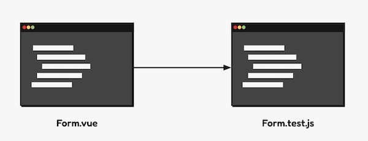

<p align="center"><small><span>Original Photo by <a href="https://unsplash.com/photos/macbook-pro-on-top-of-brown-table-1SAnrIxw5OY" target="_blank" rel="noopener">Kari Shea</a></span></small></p>

## Table of Contents

```toc

```

## Ngomongin Testing

Apakah kamu seseorang yang _skeptis_ dan malas untuk menulis automation test di kodemu? Jika iya, maka kamu adalah saya beberapa tahun lalu. 

Simpelnya seperti ilustrasi berikut:



Waktu pertama kali tau kalau konsep "Automation Testing" itu artinya kita membuat kode tambahan dari kode yang kita tulis, seperti gambar di atas, gejolak penolakan datang dari hati yang paling dalam.

Bagaimana tidak, katakanlah kita butuh waktu seharian bikin _logic_ dari kode kita, masih harus bikin satu lagi file test yang bisa aja susah bikinnya. Sungguh merepotkan. Memang apa salahnya di test langsung di _browser_?

Waktu 

Saya pernah menulis tentang alasan [kenapa kita harus repot bikin automation test](/ngapain-repot-bikin-automation-test/). Saya sarankan kamu membacanya jika kamu belum yakin kenapa kita melakukan automation testing. 
