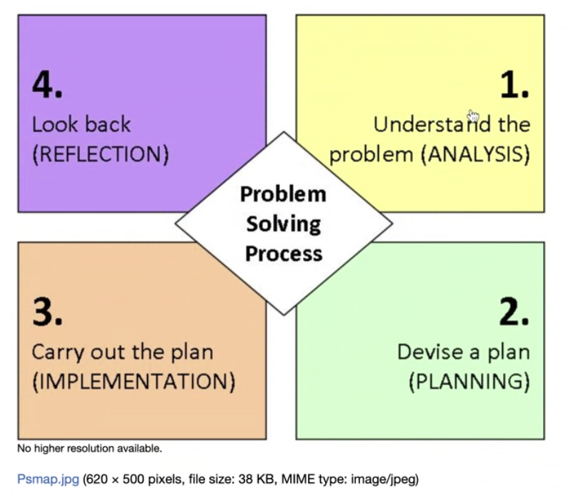

<small>Original Photo by <a href="https://unsplash.com/photos/a-close-up-of-a-logo-j_DmMNZK-jo" target="_blank" rel="noopener">Gaspar Uhas</a></small>

# Main Ideas

## 5 Stages of Problem-Solving

1. Define the problem: Bisa jadi perlu ngundang orang-orang terkait untuk meng-clear-kan masalah utamanya.
2. Generate Solutions: Membuat beberapa solusi, jangan cuma satu.
3. Evaluate solutions: Evaluasi setiap solusi. Breakdown pros and cons nya.
4. Pick the solution: Dari hasil evaluasi poin nomor 3, pilih salah satu solusi yang effort nya paling rendah namun tetap bisa memecahkan masalah.
5. Make a Plan: Buat rencana bagaimana mengeksekusi ide tersebut

## Problem Solving Framework

## Problem Solving Principles

1. Make it simple. Pecah solusi sekecil mungkin. Slicing problemnya.
2. Komunikasi. Bisa mempercepat kerjaan dan mempermudah.
3. Documenting. Fungsinya penting supaya kita bisa mengevaluasi solusi yang sedang kita lakukan. Kedua itu bakal berguna untuk temen-temen kita yang lain.
