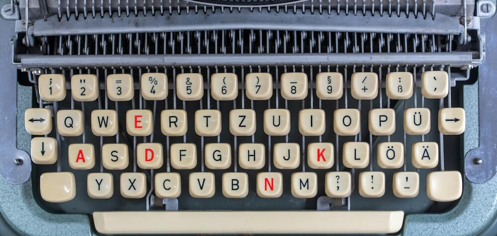
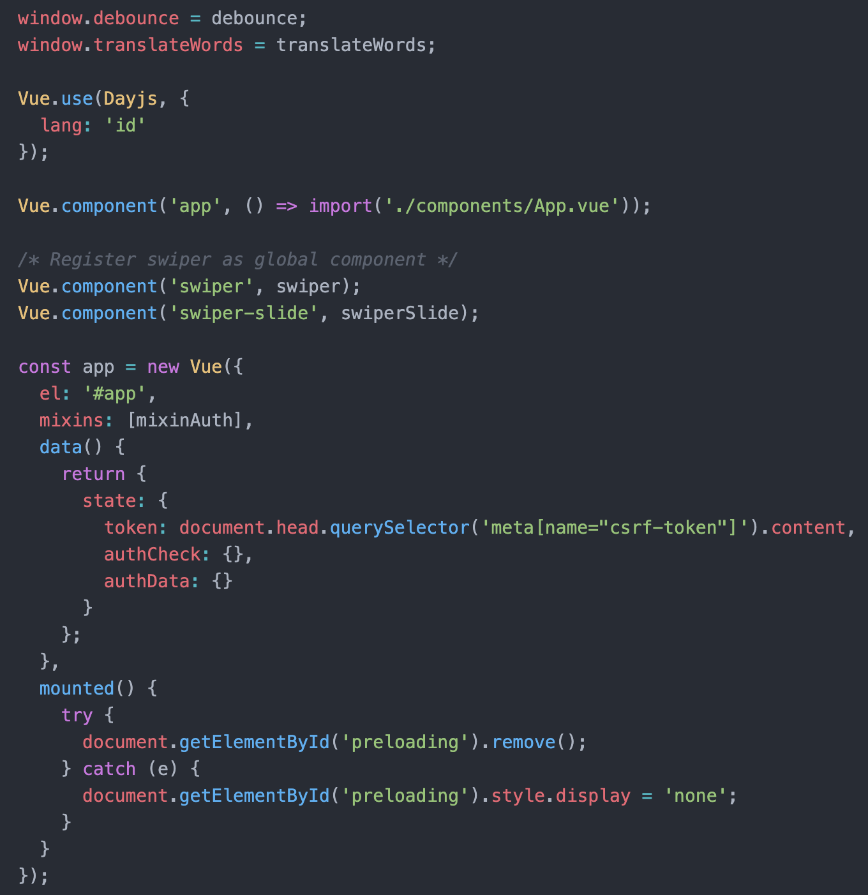
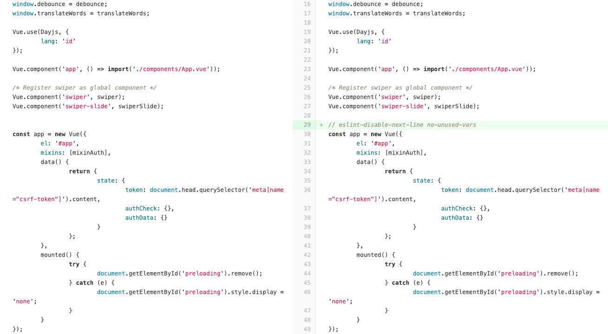
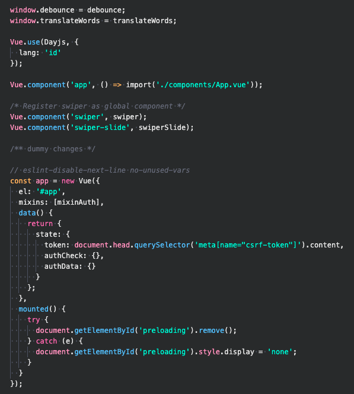
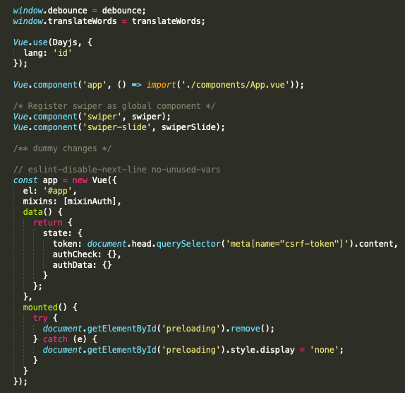

<p align="center"><small><span>Original Photo by <a href="https://unsplash.com/photos/black-and-white-typewriter-on-brown-wooden-table-di8ognBauG0" target="_blank" rel="noopener">Wilhelm Gunkel</a></span></small></p>

**⚠️ Warning:** The opinion in this article may differ from your own. You can also share your opinion in the comment section below if you disagree with me 😁.

## Preface

Tabs and spaces are two different characters that are rendered as whitespace on screen.

The problem is that there is no agreement on how wide a tab character must be, so some editors show it as occupying as much space as 8 spaces, some show it as occupying width of 4 and some 2, and it’s also configurable.

There is a really nice article called [Spaces vs. Tabs: A 20-Year Debate Reignited by Google’s Golang](https://thenewstack.io/spaces-vs-tabs-a-20-year-debate-and-now-this-what-the-hell-is-wrong-with-go/) that shows that it's still debatable until now which one is better.

If you ask me, I'm a person who believe **Spaces are better than Tabs**.

## Tabs: Inconsistency across editors

I tried to use tabs using several text editors, but I always ended up using spaces. Here are some examples of how tabs are rendered across different editors:

### Visual Studio Code


### Sublime Text


### Atom



### Gitlab Code Review



As you can see, the indentation is not consistent across editors. This might be a problem if you're working in a team where each member uses different editors.

## Spaces: Consistency across editors

If you really care about precision, then I recommend to choose Spaces over Tabs. Now, let's try to change the indentation of the file above using Spaces as its indentation, and then see how editors will render the indentation.

### Visual Studio Code



### Sublime Text



### Atom


### Gitlab Code Review


## Conclusion

As you can see, Spaces offer more consistent indentation over Tabs across editors. That’s also why I encourage my team to update their configuration to use spaces. The easiest way to update the indentation is just simply to update the configuration on `.prettierrc` file, since we're using [Prettier](https://prettier.io/) to format our code.

```
{
  ...
  "useTabs": false
  ...
}
```

After that, make sure to turn on the "Format on Save" option on the text editor.
