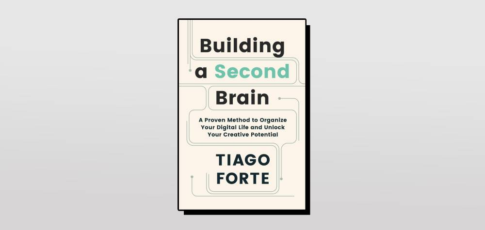
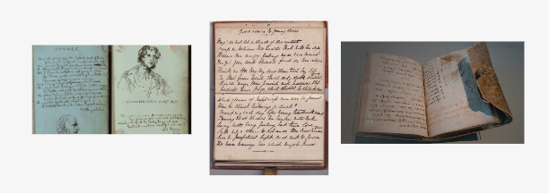

Beberapa waktu lalu ketika mampir ke sebuah toko buku di dekat rumah, saya menemukan sebuah buku yang cukup menarik perhatian saya berjudul "Building a Second Brain", ditulis oleh Tiago Forte. 

Setelah selesai membaca buku tersebut dan mencoba menerapkan metode dari mas Tiago, saya merasa banyak hal yang cukup membuka pikiran saya terutama dalam mengelola informasi dan pengetahuan yang saya dapatkan. 

Saya akui, meskipun metode dari buku tersebut cukup membantu, namun hal yang paling "ngena" adalah bagaimana mas Tiago mengingatkan pembaca bahwa **kita perlu memanfaatkan teknologi untuk membantu menyimpan informasi** dikarenakan kapasitas otak kita untuk mengingat terkadang tidak selalu bisa diandalkan. 

Di artikel ini saya mencoba menulis ulang apa yang saya tangkap dari buku tersebut, karena saya percaya menulis bisa membantu saya memvalidasi pemahaman saya. 

### Tentang Informasi

Saya sangat setuju ketika mas Tiago bilang bahwa kualitas pekerjaan dan kehidupan kita sangat bergantung bagaimana kita memproses informasi yang kita dapatkan secara efektif. Sayangnya, kita selalu mengkonsumsi informasi berlebih sehingga sangat susah bagi otak kita untuk selalu mengingat semuanya, seringnya kita malah banyak lupa. 

Karenanya, kita harus terima kalau kita gak selalu bisa mengandalkan otak kita untuk menyimpan semua informasi yang bahkan kita mau dan butuhkan sekalipun.

> Your mind is for having ideas, not holding them 
-- David Allen

### Apa itu Second Brain?

Second Brain adalah sebuah metode untuk menyimpan ide, pengetahuan, informasi yang kita dapatkan. Second Brain ini seperti **meng-upgrade memori kita dengan menggunakan teknologi** modern seperti Smartphone, Laptop, Smartwatch, dll. 

Sebenarnya konsep ini juga gak baru-baru amat, dari jaman dahulu para intelek punya kebiasaan menyimpan informasi yang mereka dapat ke buku catatan yang biasa disebut "Commonplace Books". Dengan buku ini, mereka mengingat semua informasi dan menyambungkan setiap informasi sehingga menginspirasi mereka memproduksi informasi baru.

<small>Commonplace Books. Foto dari <a href="https://balzerdesigns.typepad.com/balzer_designs/2023/06/what-is-a-commonplace-book.html" target="_blank" rel="noopener">balzerdesigns.typepad.com</a></small>

Sederhananya, Commonplace Books versi digital = Second Brain. 

Oleh karenanya Second Brain sering diasosiasikan dengan aplikasi Note, meskipun sebenarnya tidak terbatas oleh aplikasi Note saja. 
