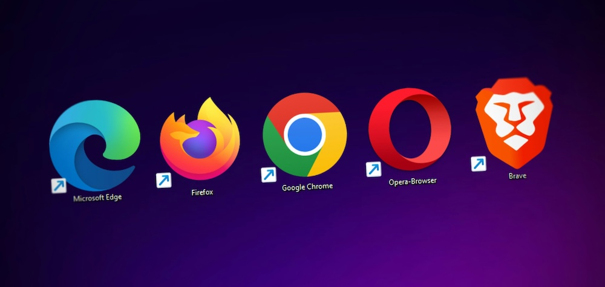
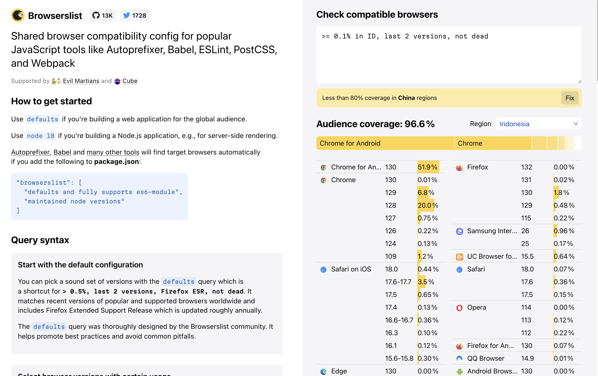

<p align="center"><small><span>Original Photo by <a href="https://unsplash.com/photos/logo-JySoEnr-eOg?utm_content=creditShareLink&utm_medium=referral&utm_source=unsplash" target="_blank" rel="noopener">Denny Müller</a></span></small></p>

## Table Of Contents

```toc

```

## Preface

When determining the minimum browser requirements for your site, sometimes [analyzing our site’s browser visitors with Google Analytics](/en/how-to-analyze-browser-visitors-with-google-analytics-4/) could be enough. However, validating and combining this with global usage data would be better.

Why? Let’s say your Google Analytics report shows that iOS Safari users on your site are primarily on version 18 (a recent release).

In this case, relying only on this data is a bit naive since it ignores the potential visitors who haven’t yet accessed your site. Therefore, it’s crucial also to examine the global users’ trends.

## Browserslist

My favorite tool to check real-world browser usage data is [Browserslist](https://github.com/browserslist/browserslist). This tool integrates data from the [Caniuse database](https://caniuse.com/) and [StatCounter GlobalStats](http://gs.statcounter.com/) to help us make decisions on browser support.

We can use Browserslist in two ways:

1. Through the web-based playground: [https://browsersl.ist](https://browsersl.ist/)
2. Via the CLI by running the `npx browserslist` command in our Terminal.

While the website playground is a quick and easy way to check browser compatibility without setup, the CLI method allows for deeper integration with your development workflow, making it perfect for projects that need ongoing, automated browser support checks.

For the sake of simplicity, let’s use the website playground instead in this article.


## Browserslist Query

To use Browserslist effectively, we need to understand its query syntax. Here, I’ll cover a few queries that I frequently use. For more in-depth options, you can refer to [their official GitHub repository](https://github.com/browserslist/browserslist?tab=readme-ov-file#query-composition).

### Using the Defaults Query

The easiest way to check the global browser usage data is by using `defaults` query.


Browserslist uses a unique query syntax to retrieve its data. It includes a special keyword called `defaults`, which serves as a shortcut for `> 0.5%, last 2 versions, Firefox ESR, not dead`.

But, what does it mean?

- `> 0.5%`: All versions with > 0.5% of the audience worldwide
- `last 2 versions`: Last 2 recent versions of each browser. This part is necessary because new browsers will always < 0.5% of the audience after release.
- `Firefox ESR`: Include the latest [Firefox Extended Support (ESR)](https://support.mozilla.org/en-US/kb/firefox-esr-release-cycle#:~:text=Firefox%20offers%20an%20Extended%20Support,extended%20support%20for%20mass%20deployments.).
- `not dead` : Exclude Browsers without official support or updates for more than 24 months. For example: IE 11, Blackberry 10, Samsung 4, etc.

It’s important to note that the `defaults` query adapts over time based on browser usage patterns, ensuring that your site maintains compatibility with popular browsers as the web landscape evolves.

However, this query may sometimes include browsers you don’t want to support, so it’s a good idea to customize it for your specific audience.

### Customizing Queries by Region

For instance, if you’re targeting an audience in Indonesia, you could use the following query:

```
>= 0.1% in ID, last 2 versions, not dead
```

This query targets any browser with over 0.1% usage in Indonesia, includes the two latest versions of each browser, and excludes outdated browsers. This customization ensures that your site is optimized for the specific audience you’re targeting.



### Additional Customization Examples

These examples highlight how flexible Browserslist is, allowing you to fine-tune compatibility based on your exact needs:

#### Specific Browser Families

To only support recent versions of Chrome and Firefox, you could use:

```
Chrome >= 90, Firefox >= 88
```

#### Excluding Certain Browsers

If you want to exclude Internet Explorer from your support list, try:

```
> 0.5%, last 2 versions, not IE 11
```

#### Following Google Baseline

If you’re not familiar with [Baseline](https://web.dev/baseline), it’s an initiative by the [WebDX Community Group](https://www.w3.org/community/webdx/) to identify features that are stable and widely supported across all major browsers.

To support _Baseline Widely Available_ features, use this Browserslist query:

```
chrome > 0 and last 2.5 years,
edge > 0 and last 2.5 years,
safari > 0 and last 2.5 years,
firefox > 0 and last 2.5 years,
and_chr > 0 and last 2.5 years,
and_ff > 0 and last 2.5 years,
ios > 0 and last 2.5 years
```

This query ensures compatibility with features meeting Baseline’s stability criteria across desktop and mobile.

## Conclusion

If this is your first time using Browserslist, you might be confused about what query you should use. Unfortunately, there’s no one-size-fits solution for it and it’s up to you to define it.

In most cases, starting with the `defaults` query is a good choice, as it covers widely used browsers and recent versions. As you gather more data on your audience, you can adjust the query to better reflect your users’ actual browsing habits.

To take it a step further, I recommend installing Google Analytics or a similar tool to collect data on your real users. Over time, this data will help you refine your Browserslist settings, ensuring your site stays accessible to the users that matter most.
