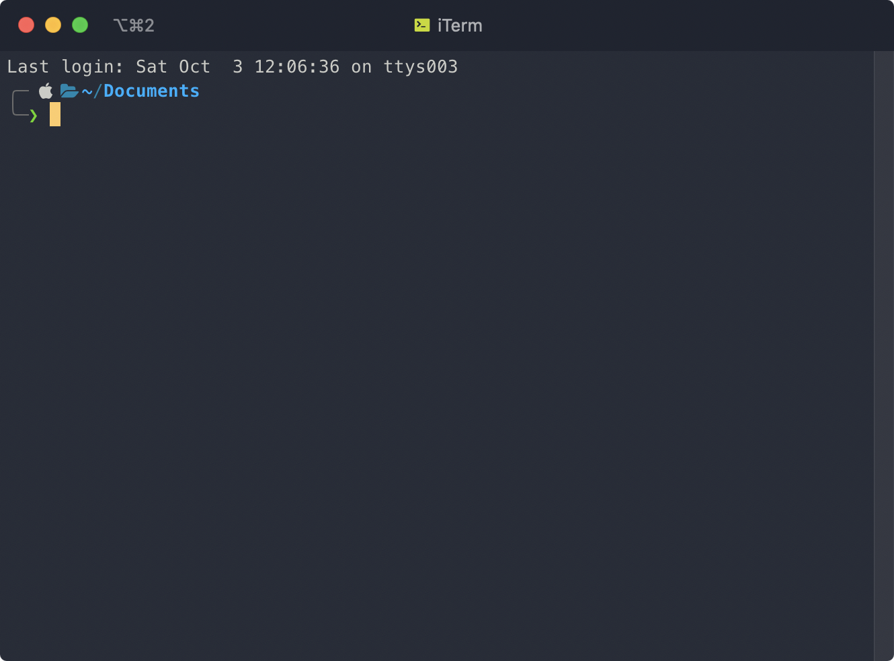
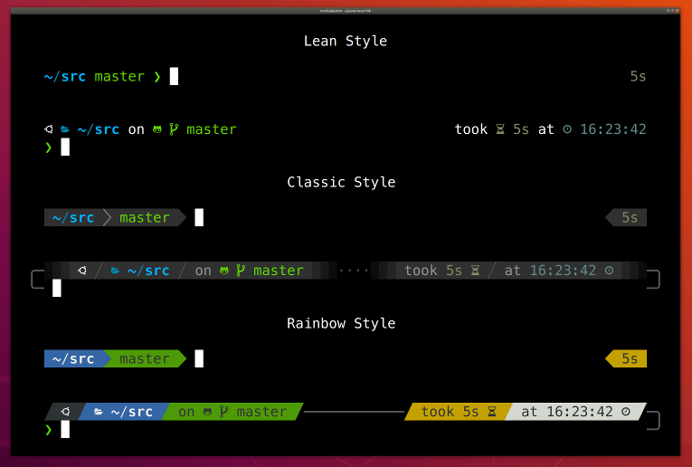

import Video from "../../../components/Video";

## Preface

Halo, disini saya mau sharing beberapa tips di Terminal yang saya pakai sehari-hari.
Tips yang mau saya bagikan di sini lebih ke sharing plugin-plugin yang bisa di install di terminal kita.. Harapannya, plugin-plugin yang saya pakai di sini semoga bisa berguna dan memudahkan pekerjaan kamu juga.

## iTerm

Hampir tiap hari saya pakai Terminal di kerjaan saya, entah itu buat ngejalanin perintah git, install node dependencies, ngejalanin npm scripts, dan lain-lain. Karena kebetulan saya pakai Mac, Terminal bawaan dari Mac tidak cukup bikin saya puas karena kustomisasi yang tersedia cukup sedikit.

Jadi buat ngegantinya, saya install iTerm karena iTerm ini punya banyak opsi yang bisa di kustomisasi, contohnya seperti shortcut, tema, dan banyak pengaturan lain yang bisa kita atur sesuai keinginan kita. Yaa, sebenernya gak banyak sih yang saya kustomisasi di iTerm, tapi karena saya udah terbiasa pakai ini dari dulu, jadi belum coba alternatif terminal yang lain.



<small class="text-center block">
  <i>Gambar 1: Penampakan iTerm</i>
</small>

Tapi ini sharing aja ya, saya gak bilang kamu harus pakai iTerm 😀

## [Thefuck](https://github.com/nvbn/thefuck)

Plugin yang pertama yaitu thefuck, ini adalah plugin terminal terlucu yang saya tau. Btw saya tau plugin ini pertama kali dari [om Mul](https://github.com/mul14) 😀

Pasti sering kan kita tiap mau ngejalanin perintah di CLI itu typo. Misal :

- `git status` malah jadi `git stats`
- `yarn` jadi `yan`
- `git log` malah jadi `git lig` 😅
- Atau kasus lain misal mau ngejalanin perintah tertentu ternyata harus pakai perintah `sudo`, misal `rm -rf my-folder` gak bisa dan harus pakai `sudo` didepannya, jadinya kita harus ngulangin nulisin perintah kita jadi `sudo rm -rf my-folder`.

Cukup _annoying_ bukan?

Nah si [thefuck](https://github.com/nvbn/thefuck) ini ngebantu kita buat ngebenerin typo atau hal lain. Penggunaanya cukup simpel, tiap kali kita gagal ngejalanin suatu perintah, kita tinggal tulis `fuck`, maka perintahnya jalan 😅

import ThefuckPluginInActionWebm from "./images/thefuck-plugin-in-action.webm";
import ThefuckPluginInActionMp4 from "./images/thefuck-plugin-in-action.mp4";

<Video webm={ThefuckPluginInActionWebm} mp4={ThefuckPluginInActionMp4} />

<small class="text-center block">
  <i>Gambar 2: thefuck in action</i>
</small>

Kalo kamu perhatikan di video di atas, thefuck masih akan nanya ke kita terlebih dahulu tentang perintah yang kita maksud sebelum dia eksekusi. Jika kita oke, maka kita cukup tekan Enter.
Kalo kita lagi frustasi dan lagi sensitif dan gak pengen ditanya-tanya, kita cukup ketikkan perintah `fuck --yeah` dan thefuck gak bakal nanya kekita terlebih dahulu dan dia langsung akan eksekusi perintah yang dia rasa benar.

import ThefuckPluginInAction2Webm from "./images/thefuck-plugin-in-action-2.webm";
import ThefuckPluginInAction2Mp4 from "./images/thefuck-plugin-in-action-2.mp4";

<Video webm={ThefuckPluginInAction2Webm} mp4={ThefuckPluginInAction2Mp4} />

<small class="text-center block">
  <i>Gambar 3: fuck yeah!</i>
</small>

## [Oh-My-ZSH](https://github.com/ohmyZSH/ohmyZSH)

Buat temen-temen yang mungkin perlu buat dibantu hidupnya, dan thefuck tadi nggak cukup membantu, bisa cobain install ZSH (dibaca _zishel_).

Jadi dengan ZSH, ada banyak banget plugin yang bisa kita pasang, tapi untungnya ada satu framework buat ZSH buat nge-_manage_ konfigurasi ZSH, yang namanya Oh-My-Zsh.
Jadi, ketika Oh-my-ZSH ini kita install, kita bakal dapet banyak banget plugin sama tema ZSH yang tinggal kita aktifin doang di konfigurasinya, jadi gak perlu download-download lagi.

Konon katanya, orang kalo udah pakai oh-my-ZSH trus tau plugin2 nya yg keren, dia bakal ngomong "Oh My Ziii"

import OhMyWebm from "./images/oh-my.webm";
import OhMyMp4 from "./images/oh-my.mp4";

<Video webm={OhMyWebm} mp4={OhMyMp4} />

<small class="text-center block">
  <i>Gambar 4: Oh My Zii</i>
</small>

Kamu bisa install Oh-My-ZSH [di sini](https://github.com/ohmyzsh/ohmyzsh), Tapi ingat ya Oh-My-ZSH ini tuh semacam framework buat ZSH, jadi kamu perlu install dulu ZSH nya [di sini](https://github.com/ohmyzsh/ohmyzsh/wiki/Installing-ZSH)

Untuk bisa dapet momen _oh my zii_-mu sendiri, kamu harus nyobain sendiri plugin yang ada. Kamu bisa lihat daftar plugin yang dia sediakan [di sini](https://github.com/ohmyzsh/ohmyzsh/wiki/Plugins)

## Plugins Oh-My-ZSH

Kalo kamu sudah lihat plugin yang Oh-My-ZSH sediakan, pasti ada banyak banget sampe bikin kita pusing milih yang mana 😅 Disini, saya mau tunjukin beberapa plugins yang saya pakai dengan harapan kamu terbantu juga dengan adanya plugin yang sering saya pakai

### Git

Nah, plugin Oh-My-ZSH yang sering banget saya pakai itu Git , setelah kita pasang Git di Oh-My-ZSH, kita bisa jalanin perintah git dengan lebih singkat karena plugin ini ngasih kita kumpulan perintah shortcut.

Berikut beberapa contoh shortcut yang saya maksud :

- `gst` → `git status`
- `glo` → `git log --oneline`
- `gb` → `git branch`
- `gcmsg "pesan commit"` → `git commit -m "pesan commit"`
- `gcb "nama branch"` → `git checkout -b "nama branch"`
- `gco "nama branch"` → `git checkout "nama branch"`

Dan masih banyak lagi, kamu bisa lihat shortcut lengkapnya dan juga cara install pluginnya [di sini](https://github.com/ohmyzsh/ohmyzsh/tree/master/plugins/git)

import GitPluginInActionWebm from "./images/git-plugin-in-action.webm";
import GitPluginInActionMp4 from "./images/git-plugin-in-action.mp4";

<Video webm={GitPluginInActionWebm} mp4={GitPluginInActionMp4} />

<small class="text-center block">
  <i>Gambar 5: Git Plugin in action</i>
</small>

### Yarn & Composer

Karena kerjaan saya sehari hari berhubungan dengan node package dan sedikit composer package. Plugin yarn & composer ini kurang lebih sama dengan Git, dia sudah nyediain shortcut-shortcut yang bisa kita pakai.

#### Yarn

- `y` → `yarn`
- `yd` → `yarn dev`
- `yt` → `yarn test`
- `yb` → `yarn build`
- `yad nama-package` → `yarn add -D nama-package`
- `yup nama-package` → `yarn upgrade nama-package`

#### Composer

- `c` → `composer`
- `ci nama-package` → `composer install nama-package`

Kamu bisa lihat shortcut lengkapnya dan juga cara install plugin yarn [di sini](https://github.com/ohmyzsh/ohmyzsh/tree/master/plugins/git)
dan composer [di sini](https://github.com/ohmyzsh/ohmyzsh/tree/master/plugins/composer).

import YarnPluginInActionWebm from "./images/yarn-plugin-in-action.webm";
import YarnPluginInActionMp4 from "./images/yarn-plugin-in-action.mp4";

<Video webm={YarnPluginInActionWebm} mp4={YarnPluginInActionMp4} />

<small class="text-center block">
  <i>Gambar 6: Yarn in action</i>
</small>

### Alias-Finder

Sekarang kita udah tau kalo dengan nginstall plugin-plugin di atas kita bisa dapet shortcut dari perintah yang biasanya kita ketik panjang.

Karena shortcut nya itu banyak banget, dan kalo ngehapalin shortcut satu-satu pastinya kita males dong, akhirnya shortcutnya gak dipakai karena males ngapalin semuanya sekaligus..

Trus gimana caranya kita bisa hafal? Nah, dengan alias-finder ini kita bisa cari tau alias yang udah kita daftarin. Dengan adanya alias-finder ini kita bisa hafal dengan shortcut-shortcut di atas seiring berjalannya waktu.

Misal kita mau checkout ke sebuah branch tapi lupa apa shortcutnya, kita tinggal ketik `alias-finder -l` di ikuti perintah yang kita cari.

import AliasFinderInActionWebm from "./images/alias-finder-in-action.webm";
import AliasFinderInActionMp4 from "./images/alias-finder-in-action.mp4";

<Video webm={AliasFinderInActionWebm} mp4={AliasFinderInActionMp4} />

<small class="text-center block">
  <i>Gambar 7: Alias-finder in action</i>
</small>

**Tips**: Kalo kamu rasa perintah `alias-finder -l` masih terlalu panjang, kita bisa modifikasi sedikit supaya lebih singkat.

Buka file konfigurasi ZSH dengan cara ketik perintah `nano ~/.zshrc`, trus tambahin perintah berikut didalamnya:

```shell
alias af="alias-finder -l"
```

Jangan lupa reload konfigurasimu dengan perintah `source ~/.zshrc`. Sekarang kamu cukup ketik perintah `af git status` buat nyari shortcut dari git status.

Kamu bisa lihat shortcut lengkapnya dan juga cara installnya [di sini](https://github.com/ohmyzsh/ohmyzsh/tree/master/plugins/git)

### Interactive CD

Berinteraksi dengan Terminal pasti gak pernah lepas sama yang namanya navigasi antar direktori. Untuk navigasi antar direktori biasanya kita pakai perintah `cd`.

Namun, kadang kita gak tau apa tepatnya nama folder yang mau kita tuju, jadi kita harus lihat dulu daftar folder yang ada dengan perintah `ls`.

Dengan plugin Interactive CD, kita bisa lihat langsung apa aja direktori yang ada saat kita mengetikkan perintah `cd` diikuti spasi, lalu tekan tombol Tab.

import InteractiveCdInActionWebm from "./images/interactive-cd-in-action.webm";
import InteractiveCdInActionMp4 from "./images/interactive-cd-in-action.mp4";

<Video webm={InteractiveCdInActionWebm} mp4={InteractiveCdInActionMp4} />

<small class="text-center block">
  <i>Gambar 8: Interactive CD in action</i>
</small>

Lihat cara install Interactive CD [di sini](https://github.com/ohmyzsh/ohmyzsh/tree/master/plugins/zsh-interactive-cd).

### Autojump

Interactive CD sangat membantu kita buat navigasi antar direktori. Tapi, gimana kalo ada plugin yang kita tinggal ngetikin sedikit perintah saja kita bisa langsung ke direktori yang kita tuju?

Nah, kamu bisa install Autojump buat dapet fitur itu. Misal saya sedang aktif di home direktori dan mau lompat ke direktori _blog_, maka saya cukup ketik perintah `j blog`.

Kalo nama direktorimu terlalu panjang, misal _direktori-project-keren_, kamu bisa tinggal ketik `j keren`.

Cara kerja Autojump ini, dia bakal ngerekam direktori-direktori yang sering kita kunjungi, dan ketika kita ketik perintah `j blog`, maka dia akan cari direktori _blog_ di databasenya dia buat nyari folder dengan kata _blog_.

Ketika ada 2 direktori dengan nama yang mengandung kata _blog_, maka dia akan pilih yang lebih sering dikunjungi.

Untuk bisa mulai lompat ke direktori dengan plugin ini, kita harus mengunjungi sebuah direktori minimal sekali setelah menginstall plugin ini.

Lihat cara install Autojump [di sini](https://github.com/ohmyzsh/ohmyzsh/tree/master/plugins/autojump).

### ZSH-Autosuggestions

Selain beberapa plugin untuk navigasi direktori di atas, ada satu lagi plugin yang sering saya pakai, namanya ZSH-Autosuggestions. Jadi dia akan menampilkan suggestion perintah berdasarkan yang pernah kita tulis.

import ZshAutosuggestionsWebm from "./images/zsh-autosuggestions.webm";
import ZshAutosuggestionsMp4 from "./images/zsh-autosuggestions.mp4";

<Video webm={ZshAutosuggestionsWebm} mp4={ZshAutosuggestionsMp4} />

<small class="text-center block">
  <i>Gambar 9: ZSH Autosuggestions on action</i>
</small>

Lihat cara install ZSH-Autosuggestions [di sini](https://github.com/zsh-users/zsh-autosuggestions).

## Tema

Selain Plugins, Oh-My-ZSH juga udah nyediain kita banyak banget tema yang bisa kita pakai, kamu bisa lihat semua tema yang tersedia dan juga cara installnya [di sini]().

Kalo untuk tema favorit yang saya gunakan adalah powerlevel10k, karena kita tinggal pilih tema secara interaktif dengan mengetikkan `p10k configure` dan juga _fully_ support icon-icon yang keren!



<small class="text-center block">
  <i>Gambar 10: powerlevel10k</i>
</small>

Karena PowerLevel10k ini tidak _include_ di dalam Oh-My-ZSH, maka kamu perlu download dulu temanya, [di sini](https://github.com/romkatv/powerlevel10k).

## Penutup

Ada banyak sekali plugin dari Oh-My-ZSH yang bisa kita install, semua plugin yang ada tentu berguna bagi sebagian orang, namun juga gak berguna bagi sebagian orang lagi karena semua adalah masalah preferensi. Terimakasih sudah membaca 👋
