import Video from "../../../components/Video.astro";

## Apa itu Git?

Git merupakan tool utama yang pasti akan kamu gunakan setiap hari sepanjang karirmu sebagai developer. Dengan menggunakan Git, kita dapat tau apa aja perubahan yang kita buat dalam sebuah project.

Analoginya ketika kita main game dan sudah main sampai level 5 atau lebih, kita cenderung akan men-_save_ progresnya bukan? Jadi ketika _game over_, kita ngga harus ngulang dari level 1 dan bisa mulai lagi dari level 5 karena kita udah _save_ progresnya.

Begitu juga dengan Git, kita diwajibkan buat ngedaftarin dan menyimpan perubahan dari file-file yang kita buat. Sehingga, ketika kita melakukan kesalahan, kita bisa kembali ke perubahan yang udah kita _save_.

Yang menarik, hal tersebut juga memungkinkan kamu dan temanmu mengerjakan project yang sama secara bersamaan. Dengan tool seperti Git inilah yang membuat aplikasi seperti Facebook, Instagram, dll bisa dikembangkan oleh ribuan developer secara bersamaan.

> Git hanyalah salah satu Version Control yang bisa kita gunakan. Di luar sana banyak Version Control lain yang kita bisa gunakan juga. Tapi Git merupakan salah satu yang paling Populer.

## Instalasi

Cara instalasi Git sebenarnya cukup mudah, kamu tinggal ke situsnya di https://git-scm.com/downloads dan pilih sesuai sistem operasi yang kamu gunakan.

### MacOS

Sebelum kamu menginstall Git, periksa dulu apakah Git sudah terpasang di laptopmu atau belum, karena jika kamu punya <a href="https://developer.apple.com/support/xcode/" target="_blank" rel="noopener">XCode</a> di komputermu, biasanya Git sudah terpasang secara otomatis.

Cara mengeceknya, buka aplikasi Terminal lalu ketikkan `git --version`

Ketika Git sudah terinstall maka akan tampil versi Git di Terminal. Ketika artikel ini ditulis, Git di komputer saya versi 2.24.3. Versinya bisa berbeda di komputermu, kamu tidak harus memiliki versi yang sama untuk dapat mengikuti tutorial ini.

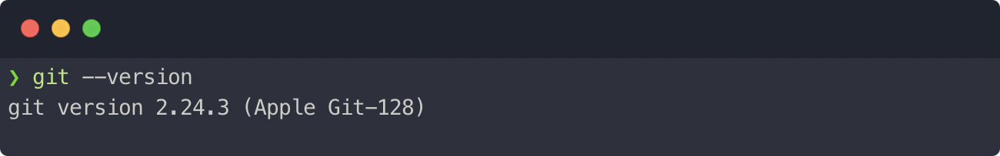

<small class="text-center block">
  <i>Gambar 1: Cek Versi Git</i>
</small>

Kalau muncul pesan semacam _command not found_, maka kamu perlu menginstall Git dulu.

Kamu bisa install Git via [Homebrew](https://brew.sh/).

```shell
brew install git
```

## Membuat Local Repository

Untuk bisa mulai pakai Git, kita harus tau dulu beberapa perintah dasar Command Line. Ada banyak perintah yang bisa gunakan tapi paling tidak, berikut ini yang paling sering dipakai:

### Perintah Basic Command Line

- `pwd` : Melihat lokasi direktori yang aktif sekarang
- `ls` : Melihat semua file dan folder di direktori yang sedang aktif
- `cd` : Berpindah direktori
- `mkdir` : Membuat direktori baru

Dengan posisi Terminal yang sudah terbuka, kamu bisa coba ketikkan perintah `pwd`. Outputnya bisa semacam **_/Users/nama-kamu_**

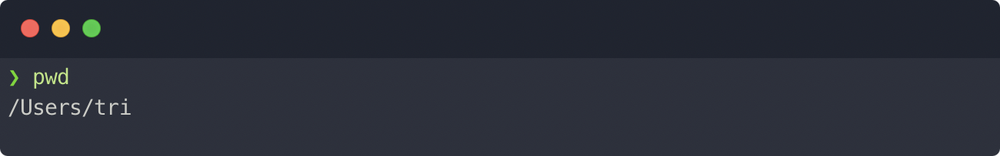

<small class="text-center block">
  <i>Gambar 2: Output pwd</i>
</small>

Setelah tau dimana direktori yang sedang aktif sekarang, buat sebuah direktori baru bernama **latihan-git** dengan `mkdir`

```shell
mkdir latihan-git
```

Untuk melihat apakah direktori kita berhasil dibuat atau tidak, kita bisa cek dengan perintah `ls`

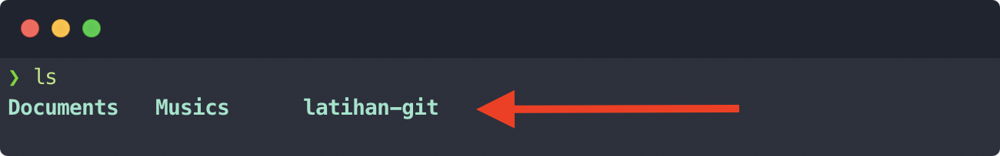

<small class="text-center block">
  <i>Gambar 3: Output ls</i>
</small>

Karena direktori kita sudah siap, masuk ke direktori tersebut dengan perintah `cd`:

```shell
cd latihan-git
```

Sampai di sini kita sudah berada di dalam direktori **latihan-git**, kamu bisa memastikannya dengan perintah `pwd`. Sekarang kamu sudah siap memulai menggunakan Git 🙌

### Perintah Basic Git

Perintah yang bisa digunakan di Git ada banyak sekali, namun kamu ngga perlu belajar semuanya buat bisa mulai. Paling ngga kamu cukup belajar beberapa perintah berikut dan sisanya belajar berdasarkan kasus.

#### Git Config

Git Config dipakai buat mengatur konfigurasi Git. Umumnya, kita ngga perlu buat mengatur semuanya secara manual dan pakai konfigurasi bawaan aja udah cukup. Tapi, sebelum memulai pakai Git, kamu wajib atur dulu profil yang kamu gunakan.

```shell
git config --global user.name "Nama Kamu"
git config --global user.email "emailkamu@gmail.com"
```

Atur isi "Nama Kamu" dan "emailkamu@gmail.com" dengan identitasmu sendiri. **Perintah ini cukup dijalankan sekali saja ketika kamu baru mulai menggunakan Git**, untuk seterusnya kamu tidak perlu menjalankan perintah ini lagi.

Untuk lihat apakah identitasmu udah berhasil didaftarkan atau belum, ketikkan perintah berikut:

```shell
git config --global user.name
git config --global user.email
```

Mengeksekusi kedua perintah di atas akan menampilkan nama dan email yang sudah kamu atur di perintah sebelumnya.

#### Git Init

Kamu cuma perlu mengeksekusi perintah ini sekali saja di setiap direktori/project (dalam hal ini direktori **latihan-git**).

Perintah `git init` digunakan buat ngasih tau ke Git kalau kita pengen supaya direktori yang sedang aktif sekarang (**latihan-git**) dikenali oleh Git, sehingga segala perubahan yang kita buat bisa dikenali olehnya.

```shell
git init
```

Setelah kamu eksekusi perintah di atas maka akan muncul pesan _Initialized empty Git Repository in blablabla_, yang menandakan Git sekarang bakal mengenali segala perubahan yang ada.

> Istilah **_Repository_** merujuk pada direktori/project/folder yang udah kita inisialisasi pakai `git init`. Dengan kata lain, **Repoitory adalah nama lain dari direktori yang Git kenali**.

#### Git Status & Git Add

Buat latihan, sekarang tambahkan file bernama **index.html** pakai _text editor_ kesukaanmu. Lalu, isi filenya dengan kode berikut:

```html:title=index.html
<!doctype html>
<html>
  <head>
    <title>Git Tutorial</title>
  </head>
  <body>
    <h1>Practicing Git</h1>
  </body>
</html>
```

Sekarang balik lagi ke Terminal dan ketikkan perintah `git status`

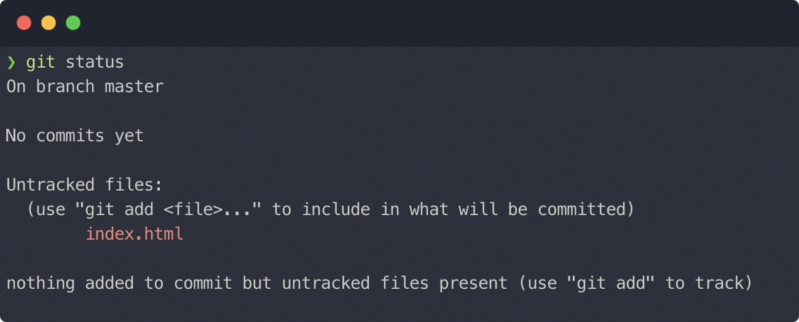

<small class="text-center block">
  <i>Gambar 5: Git Status - Untracked</i>
</small>

Dari _output_ di atas, Git ngasih tau ke kita kalau ada satu file yang tidak ia kenali yaitu **index.html** lewat pesan **_Untracked Files_**.

Git ngga akan bisa mengenali perubahan yang terjadi pada suatu file kalau kita ngga ngedaftarin file yang **_Untracked_** ke Git. Ketik perintah berikut buat ngedaftarin filenya ke Git:

```shell
git add index.html
```

Lalu eksekusi perintah `git status` lagi

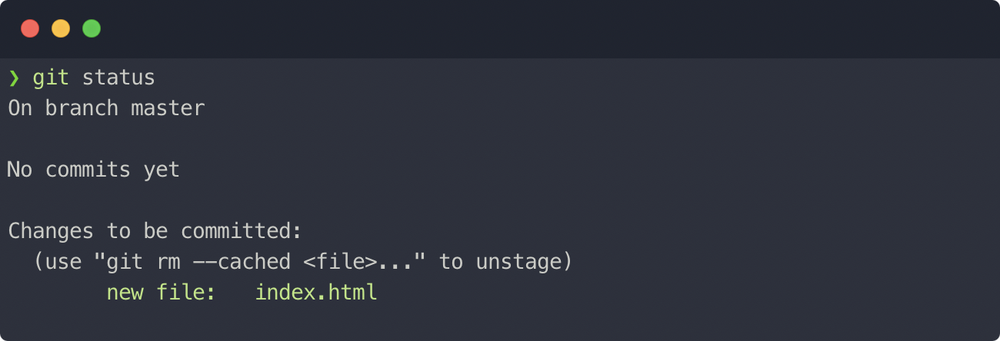

<small class="text-center block">
  <i>Gambar 6: Git Status - Staged</i>
</small>

Sekarang file **index.html** udah dalam posisi **_Staged_**, yang artinya ia udah terdaftar di Git.

#### Git Commit

Masih ingat kan analogi Game di awal artikel ini? di Git, aktivitas menyimpan perubahan yang udah kita lakukan disebut **_Commit_**.

Supaya bisa menyimpan progress kita sekarang, tuliskan perintah berikut di Terminal:

```shell
git commit -m "Membuat file index.html"
```

Ketika pakai Git Commit, kita harus menulis deskripsi singkat tentang commit yang kita lakukan.. Dalam hal ini, saya menulis pesan **"Membuat file index.html"**. Pesan ini terserah mau diisi apa, tapi pesan commit yang bagus adalah yang _nyambung_ dengan apa yang kita lakukan, supaya suatu saat kita bisa mudah ngeliat histori perubahan di project kita berdasarkan pesan commit.

#### Git Log

Sampai sini kita udah simpan perubahan yang kita lakukan, yaitu nambah file baru bernama index.html. Selanjutnya buat bisa liat apa aja commit-commit yang udah pernah kita lakukan, kita bisa pakai perintah `git log`, lalu tekan Enter.

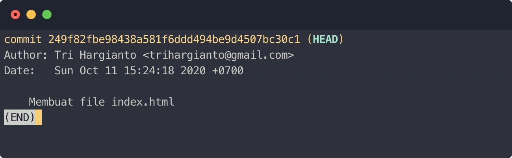

<small class="text-center block">
  <i>Gambar 7: Output Git Log</i>
</small>

Pada screenshot di atas, git log saya menampilkan satu commit aja dengan informasi yang lengkap. Dari mulai siapa yang bikin commit, pesan/deskripsi commit, sampai kapan commit itu dilakukan. Author yang muncul di Git Log adalah apa yang kita atur pada `git config` yang lalu.

> Untuk keluar dari tampilan git log, tekan tombol `q`

## Membuat Repository Online

Di awal artikel ini, saya menyebutkan bahwa kemampuan Git ini dapat dimanfaatkan untuk mengerjakan project secara kolaboratif, seperti yang dilakukan banyak perusahaan besar di luar sana. Tapi gimana caranya?

Jawabannya adalah dengan memanfaatkan satu Repository utama yang bakal jadi pusat bermuaranya kode project kita, dan Repository itu ditaruh di Hosting Repository yang biasa disebut Remote Repository supaya orang yang mau berkontribusi dalam sebuah project tinggal ambil kodenya. Remote repositor inilah yang bakal dipakai buat dirilis ke pengguna aplikasi kita. Ilustrasinya sebagai berikut:

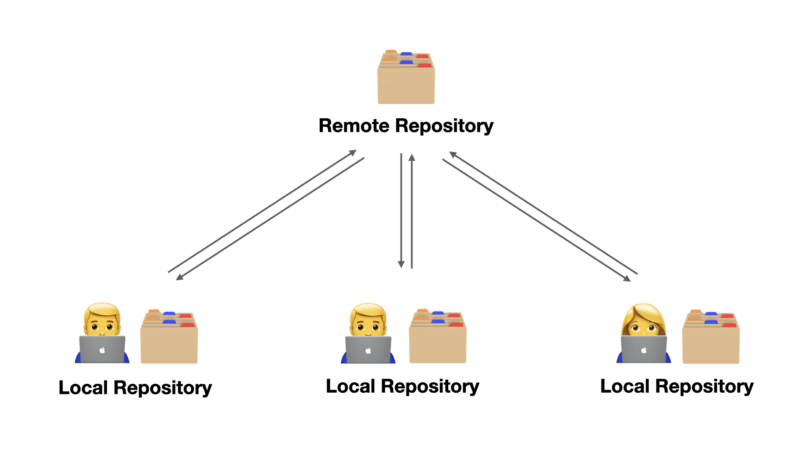

<small class="text-center block">
  <i>Gambar 8: Hubungan Remote Repository & Local</i>
</small>

> Istilah "Local" merujuk pada komputer yang digunakan Developer itu sendiri.

Remote Repository yang bisa kita gunakan, salah satunya [Github](https://github.com). Jadi Git bukanlah Github ya, Git adalah sistem. Sedangkan Github adalah salah satu Hosting Repository yang paling populer. Untuk bisa pakai layanan Github, kamu perlu punya akun dulu disana. Jika belum punya bisa daftar dulu di [situs resminya](https://github.com). Kalau udah daftar, kamu bisa lanjut buat login. Lalu, di homepage klik **New** atau klik **+** lalu **New Repository** buat bikin Repository baru.

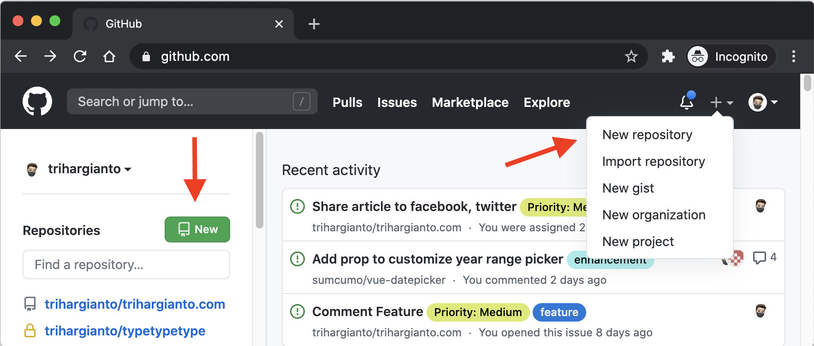

<small class="text-center block">
  <i>Gambar 9: Homepage Github</i>
</small>

Selanjutnya, isi nama Repository dan deskripsi (tidak wajib). Nama Repository ini ngga harus sama persis dengan nama direktori di _local_ kita, tapi supaya gampang dikenali, kita bikin sama aja. Jika udah semua, klik **Create Repository**

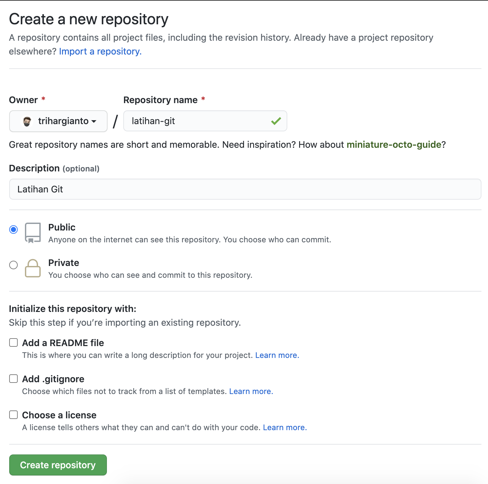

<small class="text-center block">
  <i>Gambar 10: Membuat Repository baru di Github</i>
</small>

Setelah proses pembuatan Repository di Github selesai, kamu bakal diarahkan ke Repository halaman Repository tersebut. Scroll ke bawah, lalu _copy_ kode ketiga berikut dan eksekusi di Terminal kamu.

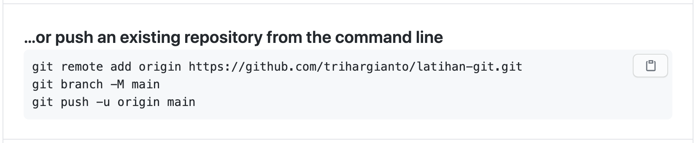

<small class="text-center block">
  <i>Gambar 11: Cara menghubungkan local Repository ke remote Repository</i>
</small>

Setelah selesai, kembali ke halaman Repository di Github, lalu refresh halamannya. Tampilannya akan berubah jadi seperti berikut:

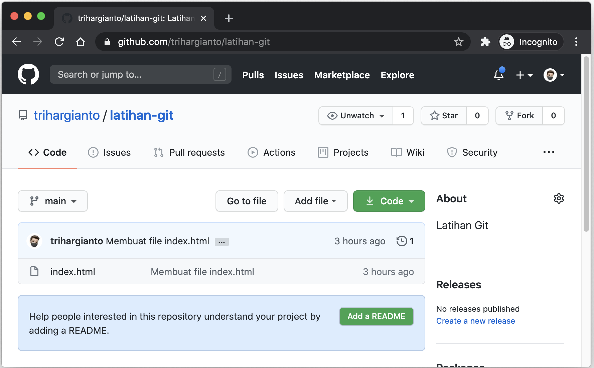

<small class="text-center block">
  <i>Gambar 12: Tampilan Repository di Github</i>
</small>

Sampai di sini, kamu udah berhasil menghubungkan Local Repository ke Github.

### Mensinkronisasi Repository

Dua perintah yang paling umum digunakan buat mensinkronisasi Local Repository dengan Remote Repository adalah `git push` dan `git pull`.

Secara ngga langsung kamu udah pakai perintah `git push` pada saat menghubungkan Local Repository ke Remote Repository (Gambar 11).

Setiap kali kamu melakukan perubahan, lalu udah selesai menyimpan semua progres dengan git commit, kamu perlu menjalankan perintah `git push`, supaya Remote Repository tersinkronisasi dengan perubahan yang kamu lakukan di _local_.

Lalu kapan kita menggunakan Git Pull?

Perintah Git Pull dilakukan ketika ada perubahan di remote Repository dan kamu hanya perlu menarik kode yang berada di Remote Repository ke Local Repository. Perubahan di Remote Repository bisa terjadi karena dua hal:

1. Kamu mengedit kode yang ada di remote Repository secara langsung di Github.
2. Ada orang lain yang melakukan Git Push ke remote Repository.

Berikut ilustrasi ketika kamu mengerjakan Repository yang sama dengan orang lain.

import NormalPushAndFullWebm from "./images/normal-push-and-pull.webm";
import NormalPushAndFullMp4 from "./images/normal-push-and-pull.mp4";

<Video mp4={NormalPushAndFullMp4} webm={NormalPushAndFullWebm} />

<small class="text-center block">
  <i>Gambar 13: Aktifitas Git Push dan Git Pull</i>
</small>

Pada ilustrasi Gambar 13 di atas, kita wajib menjalankan perintah `git pull` setiap kali ada perubahan di Remote Repository.

Bagaimana kita tau kalau ada perubahan di remote Repository? Apakah kita harus mengecek di Github terlebih dahulu? Jawabanya tidak. Kamu bakal tau dengan sendirinya, karena setiap kali ada perubahan di Remote Repository dan kamu mencoba melakukan Git Push, maka git push mu akan gagal. Jadi kamu harus melakukan Git Pull dulu.

import FailedGitPushWebm from "images/failed-git-push.webm";
import FailedGitPushMp4 from "images/failed-git-push.mp4";

<Video mp4={FailedGitPushMp4} webm={FailedGitPushWebm} />

<small class="text-center block">
  <i>Gambar 14: Git Push gagal, Wajib Git Pull terlebih dahulu</i>
</small>
