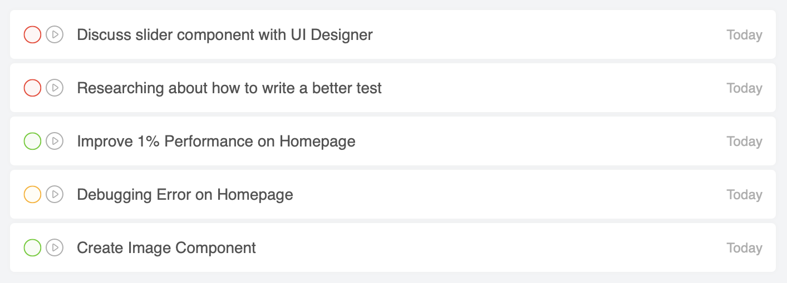
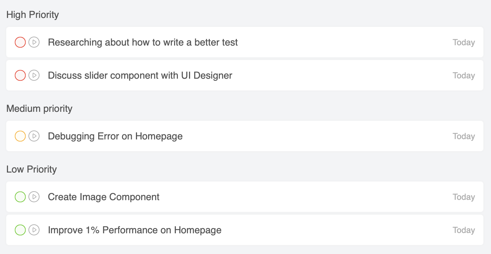

import Video from "../../../components/Video";

## Preface

Apakah kamu pernah dengar kalimat "_multitasking_ adalah mitos" ?

Saya sendiri gak terlalu paham maksud kalimat itu apa, karena nyatanya saya memang sering ngerjain banyak hal sekaligus dalam sehari. Dan sepengalaman saya, ketidakmampuan mengelola _task_ yang baik bisa berdampak buruk ke pekerjaan kita.

Selama bekerja _remote_ dari rumah (WFH), saya jadi lebih sadar betapa pentingnya punya kemampuan buat ngatur _task_ secara efektif ketika harus _multitasking_.

Berikut ini beberapa cara saya buat ngatur _task_ yang sejauh ini cukup efektif bagi saya:

## Jelas Mau Ngapain Aja 📝

Sebelum memulai hari, saya menulis semua _task_ yang akan saya kerjakan dalam sehari.

Misal, saya mulai kerja jam 9 pagi. Maka setengah jam sebelumnya, setidaknya saya harus menulis semua daftar tugas yang akan saya kerjakan sampai jam 6 sore (8jam kerja).

  <small>
    <i>Gambar 1: Ilustrasi Daftar Tugas</i>
  </small>

## Bikin Prioritas ⚖️

Setelah semua _task_ sudah ditulis, saya menentukan prioritas tiap _task_ yang telah ditulis tadi dengan memberi label tiap _task_.

Misal, label `High Priority`, `Medium Priority`, dan `Low Priority`. Hal ini untuk menentukan mana yang akan kita kerjakan terlebih dahulu tentunya.

Kenapa penting untuk menentukan prioritas?

> Jika tiap _task_ tidak ditentukan prioritasnya, maka semua adalah prioritas.

Maksudnya, kalau tidak jelas mana yang lebih prioritas, maka kemungkinan yang terjadi adalah lompat-lompat _task_ pas kerja dan berakhir gak produktif sama sekali.

  <small>
    <i>Gambar 2: Ilustrasi Daftar Prioritas</i>
  </small>

## Bikin Estimasi Waktu ⏰

Selanjutnya, tentukan estimasi waktu tiap _task_.

Misal:

1. Task A. Jam 09.00 - 10:40 (100menit)
2. Task B. Jam 11.00 - 11.50 (50menit)
3. dan seterusnya...

Dengan menentukan waktu tiap _task_, kita bisa tau berapa lama kita harus mengerjakan tiap _task_ yang akan dikerjakan tiap harinya.

## Disiplin!

Pastikan disiplin. Kenapa? Karena jika tidak, maka tidak ada gunanya metode ini. Karena tujuan utama dari metode ini adalah supaya saya bisa lebih produktif dibandingkan sebelumnya.

Sampai sini kamu kemungkinan bakal mikir:

> "Gimana kalau Task A belum selesai padahal estimasi waktunya sudah habis"?

atau

> "Gimana carannya nentuin estimasi waktu tiap _task_? Gimana kalo meleset? Apa gak berantakan tuh semua yang udah ditulis"?

Untuk hal tersebut, kamu bisa ikutin tips yang saya dapat dari teman baik saya, <a href="https://www.linkedin.com/in/yunda-bella-paramitha-25404966/" target="_blank" rel="noopener">Yunda Bella</a> berikut:

1. Ketika alokasi waktu sudah habis dan memang perlu waktu tambahan, maka bisa ambil alokasi waktu _task_ lain yang prioritasnya rendah. Namun, usahakan supaya tiap _task_ bisa diselesaikan tepat waktu untuk menghindari _overtime_.
2. Tentukan target minimal (yang cukup layak) yang harus dicapai di tiap _task_ dalam sehari. Kuncinya: "**_Knowing what's good enough (not everything should be perfect)_**".
3. Selanjutnya, selalu berusaha untuk percaya diri sama hasil dari tiap _task_ yang udah dikerjain supaya bisa pindah ke _task_ selanjutnya.

## Gunakan Aplikasi

Semua kegiatan di atas saya atur di aplikasi. Mulai dari menyusun _task_ sampai penggunaan timer.

Kamu bisa coba pakai aplikasi yang sama dengan yang saya pakai, yaitu [Focus To-Do](https://www.focustodo.cn/), sebuah aplikasi yang mengkombinasikan Todo App dan metode <a href="https://todoist.com/productivity-methods/pomodoro-technique" target="_blank" rel="noopener">Pomodoro</a>.

Sejauh ini, saya pakai aplikasi itu buat sehari-hari.

> Thanks to <a href="https://www.linkedin.com/in/rebotak/" target="_blank" rel="noopener">Alfaiz Ainurrofiq</a> udah ngasih tau aplikasi Focus To-Do ✌️

Ketika menjalankan timer di aplikasi Focus To-Do, saya juga sering kali mematikan notifikasi Slack untuk sementara supaya tidak terdistraksi ketika ngerjain _task_ (Sayangnya untuk hal ini saya masih ngelakuinnya secara manual).

## Bonus Tip: Yang Terpenting 🔥🔥🔥

> Sebaik-baiknya pekerjaan adalah **yang dikerjakan**

import GetThingsDoneWebm from "images/get-things-done.webp";
import GetThingsDoneMp4 from "images/get-things-done.mp4";

<Video webm={GetThingsDoneWebm} mp4={GetThingsDoneMp4} />

  <small>
    <i>Gambar 3: Get Things Done!</i>
  </small>

## Penutup

Apakah kamu punya teknik lain yang lebih keren untuk mengelola _task_? Jika iya, silahkan sharing juga di kolom komentar di bawah ya 👌.

Terimakasih sudah membaca. Semoga bermanfaat.
