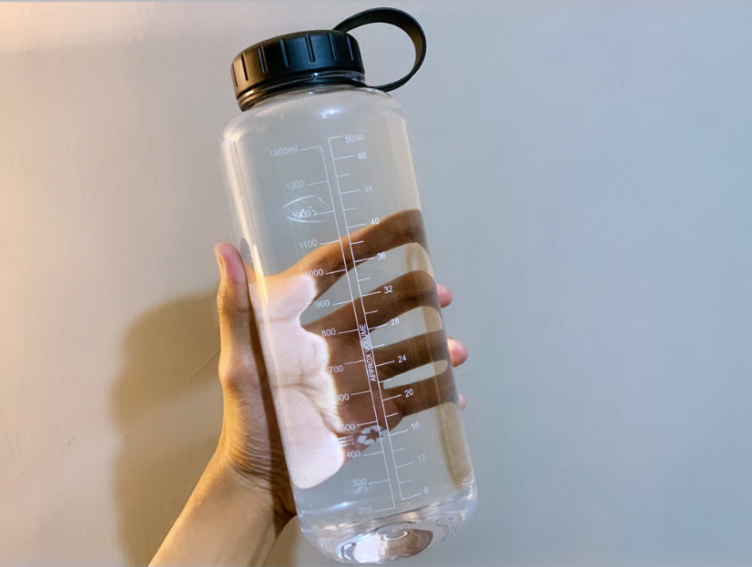

## Preface

Ketika Covid-19 mulai masuk Indonesia di awal tahun 2020, beberapa perusahaan, termasuk perusahaan tempat saya kerja memberlakukan kebijakan supaya karyawannya bekerja dari rumah. Waktu itu, dapet kabar kalau harus kerja dari rumah tentu terdengar menyenangkan, karena gak perlu repot-repot datang ke kantor.

Saat artikel ini ditulis, terhitung udah kurang lebih 12 bulan saya kerja dari rumah. Selama itu juga, saya ngerasa, ternyata kerja dari rumah cukup bikin tingkat stress saya meningkat, dan dampaknya jadi kurang produktif.

Alasannya:

1. Kurangnya interaksi fisik sama rekan kerja bikin kerjaan dan hidup kerasa monoton, gak ada kawan buat diskusi ringan atau bercanda pas lagi pusing sama kerjaan.
2. Banyak distraksi di rumah. Entah karena keponakan saya yang lucu ngajak main, tamu datang, atau beberapa masalah kecil di rumah.
3. Selain itu, jenis distraksi yang lain adalah notifikasi Slack. Karena hampir semua orang kerja di rumah dan pakai aplikasi Slack atau semacamnya, saya jadi ngerasa pesan atau notifikasi yang masuk jadi lebih “deras” kalo dibandingkan pas kerja dari kantor. Mungkin bagi orang lain, notifikasi ini gak jadi masalah yang serius-serius amat. Tapi bagi saya, ini cukup ngeganggu karena jenis pesan yang beragam, mulai dari ajakan diskusi, pertanyaan, atau permintaan buat ngecek sesuatu. Karenanya, fokus saya yang lagi ngerjain sesuatu langsung buyar karena ngerasa harus segera merespon.

Ngebiarin masalah-masalah di atas tanpa solusi apapun bakal nambah tingkat stress saya. Jadi, saya perlu cari cara supaya bisa tetep produktif meskipun kerja dari Rumah.

Lalu, apa yang saya lakukan buat mengatasi permasalahan di atas?

## Membuat Kerja Multitasking Efektif

Selama bekerja remote dari rumah (WFH), saya jadi lebih sadar betapa pentingnya punya kemampuan buat ngatur task secara efektif ketika harus multitasking.

Beberapa waktu lalu, saya nulis artikel terpisah tentang <a href="/blog/cara-supaya-kerja-multitasking-efektif" target="_blank" rel="noopener">Cara Supaya Kerja Multitasking Efektif</a>. Sejauh ini, metode tersebut juga cukup efektif menjaga saya untuk menghindari kebiasaan menunda-nunda.

Kamu bisa baca artikelnya dulu supaya bisa memahami artikel di halaman ini secara utuh 👌.

## Virtual Meeting

Selama bekerja dari rumah, saya ngerasa ada sesuatu yang hilang.

Beberapa bulan belakangan, saya baru menyadari betapa pentingnya untuk berinteraksi dengan sesama rekan kerja ketika di kantor.

Karena sekarang jarang ketemu, dampaknya saya jadi gak terlalu kenal temen-temen satu kantor yang lain karena sampai sekarang saya belum pernah bertemu langsung dengan kebanyakan dari mereka.

Karena kami gak bisa ketemu langsung, kami mencoba mengadakan sebuah acara sesama engineer di satu bidang via Google Meet. Acara tersebut kami isi dengan sesi-sesi hiburan, permainan, dan sharing session di luar kerjaan.

Meskipun mungkin bukan solusi terbaik, beberapa minggu sekali menghabiskan waktu 2-3 jam membicarakan hal di luar kerjaan bagi kami cukup menyenangkan.

## Nyari Hobi Baru

Kalo ditanya hobi saya apa, jujur saja saya juga bingung. Saya dari dulu tidak pernah punya hobi spesifik. Tapi ternyata hal ini justru bikin saya jadi "hobi nyari hobi".

Akhir-akhir ini saya senang sekali nyari hal-hal baru yang bisa saya cobain. Mulai dari ngutak-atik mechanical keyboard, ngoleksi buku fisik & digital (tentunya dibaca ya), main game di Nintendo Switch & PS4, beli gadget aneh-aneh (yang biasanya dijual lagi kalo udah bosen), sampai nyobain metode beres-beres rumah dari <a href="https://shop.konmari.com/collections/books/products/the-life-changing-magic-of-tidying-up-1" target="_blank" rel="noopener">Marie Kondo</a>.

Kamu juga bisa mencoba hal-hal baru yang bisa menghiburmu seperti yang saya lakukan.

Memang, hal-hal di atas gak bisa dibilang hobi juga sebenernya, karena gak semuanya bertahan lama, tapi bagi saya itu cukup menghilangkan stress karena jadi selalu punya hiburan baru.

## Banyak Minum Air Putih

Selain gak punya hobi, saya tipe orang yang jarang minum air putih. Dulu, saya mungkin cuma minum 1-3 gelas per hari.

Saya sering dengar betapa pentingnya minum air putih 8 gelas sehari tapi selama ini saya gak terlalu memikirkan hal itu, karena memang biasanya saya minum cuma kalo habis makan atau memang lagi haus aja.

Namun akhir-akhir ini saya cukup sadar pentingnya air bagi tubuh, terutama otak.

Dari artikel yang saya baca, otak yang terhidrasi dengan baik bakal dapet banyak manfaat:

1. Meningkatkan konsentrasi
2. Menyeimbangkan mood
3. Daya ingat yang lebih baik

Dari situ saya coba disiplin buat minum air putih paling enggak 8 gelas / 1.5 liter perhari.

Supaya disiplin, yang saya lakukan adalah mengisi botol air minum berkapasitas 1.5 liter sampai penuh sebagai target buat dihabisin selama sehari.

<small><i>Gambar 1: Botol Minuman Favorit</i></small>

Setelah beberapa bulan membiasakan diri saya merasa otak jadi lebih seger buat dipake kerja.

Kalau kamu belum minum air putih cukup tiap harinya, saya saranin lakukanlah mulai hari ini 😁

## Tidur Yang Cukup

Selain air putih, tidur 7-8jam sehari sangat berpengaruh ke kinerja otak. Saya selalu berusaha tidur cukup dan menghindari begadang. Karena kalau udah begadang, biasanya keesokan harinya otak susah buat diajak mikir, badan lemes, dan ngantuk.

Jadi, gimana caramu supaya bisa tetep waras dan produktif ketika bekerja dari rumah? Boleh di share juga di kolom komentar di bawah.

Oh ya, terimakasih sudah membaca. Semoga tulisan ini bermanfaat.
