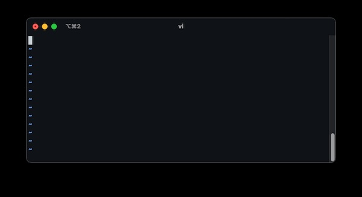
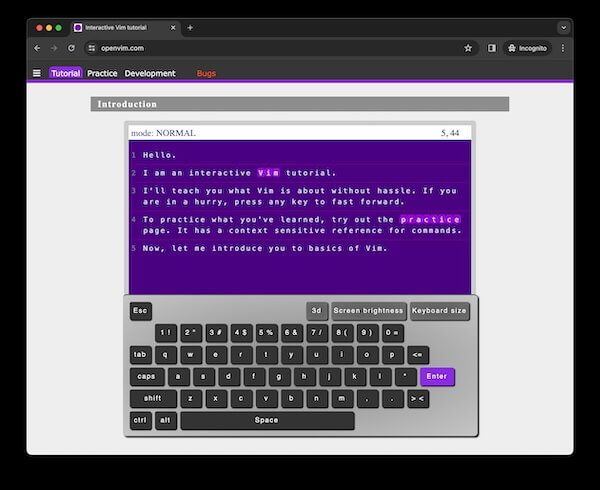
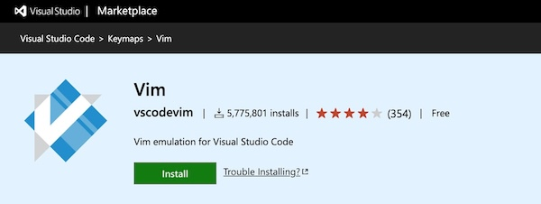
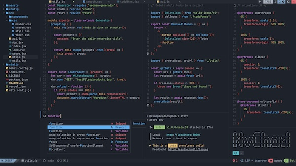

import Video from "../../../components/Video";

## Background

"[Vim](https://www.vim.org/)", one of the most challenging text editor for me.
I've remembered when I tried Vim for the first time, its feels so terrible. At
least for me who wrote code for the first using
[Notepad++](https://notepad-plus-plus.org/downloads/).

Coding is all about thinking and logic. Writing code sometimes can be
frustrating. If we need to think harder about how to use a text editor, it's so
silly.

This is how its feels like to use Vim for the first time:

- If we want to use Vim, open the Terminal first, then we need to type `vim` or
  `vim file-name.js`
- When Vim gets opened, there's only a black screen. There's no buttons like
  "New file", "Save", "Undo", "Redo", etc.
- In this damn black screen, I thought I can start writing something, but I
  still can't. There's nothing happened when I pressing buttons on my keyboard.
  Not, until I press the `i` key first.
- After wrote some text, I start to confuse again. I just remembered that
  there's no "Save" button nor "Exit" button. After _gooling_ for a while, I
  found out that I need to press Esc first, then type `:wq`.
- That's all we need to do to even just putting a single word to the file. That
  was a bad experience for me, I don't want to use it again for years. I need a
  text editor to support my productivity, not the other way around.

Years after that, I always see someone use Vim in the Internet or in the
[JogjaJS Community](https://jogja.js.org/) offline event. I also found that Vim
ecosystem in the [Github](https://github.com/search?q=vim&type=repositories) is
very active.

This made me thinking:

> It's make no sense people keep using Vim if it's very hard to use and
> decreasing productivity.

With that in mind, I made my commitment to always use Vim when there's no
deadline on my work or on my spare time, like when working on my
[Pet Projects](/pet-projects) for instance. The reasons are:

- Give Vim its second chance, to prove whether it really make us productive or
  the other way around.
- Want to use another text editor other than
  [VSCode](https://code.visualstudio.com/).
- The last thing is just because I want to look cool.

## Phase 1: Learn the Basic Commands

In this first phase, I tried to find out how exactly to use Vim. I learnt about
Vim basic commands via [openvim.com](https://www.openvim.com/). I really
recommend this site for all of you who want to learn on how to use Vim.

Even though I don't remember all the things, at least now I know how to insert
text, save file, and know a bit about what Command Mode, Visual Mode, and Insert
Mode actually is.

## Phase 2: Use VSCodeVim

After knowing how to use Vim a bit, I don't use the real Vim in the Terminal,
but I use
[VSCodeVim Plugin](https://marketplace.visualstudio.com/items?itemName=vscodevim.vim)
instead. I've been using it for 6 months and I think this plugin is perfect for
someone like me who use VScode in the daily basis but also want the Vim
experience on it.

## Phase 3: Use zsh-vi-mode on my Terminal

I found out that this plugin is also useful on my Terminal.

With [zsh-vi-mode](https://github.com/jeffreytse/zsh-vi-mode), we can have Vim
experience when I need to put some commands on our Terminal. Let's say we have a
really long command, navigating the text command using Vim shortcut is really
easy with this plugin:

import ZshViModeWebm from "images/zsh-vi-mode.webm";
import ZshViModeMp4 from "images/zsh-vi-mode.mp4";

<Video webm={ZshViModeWebm} mp4={ZshViModeMp4} />

I really recommend this to be installed on your Terminal 👍

## Phase 4: Use NvChad

[NvChad](https://nvchad.com/) is one of the most popular Vim Distribution in the
Internet. "Distribution" means Vim with full package. There's several Vim
built-in plugins installed, so we can expect it'll has similar features compared
to other popular text editors like VSCode.

There are some other popular Vim Distribution, like
[LunarVim](https://www.lunarvim.org/) and [AstroVim](https://astronvim.com/).

The reason why I choose NvChad is simply because when this article was written,
NvChad has more Github stars than the others. I don't know anything about Vim
plugins, I hope NvChad is good for me 😅

You might be thinking, why do I use NvChad if I can just use VSCodeVim? It's
because I want to know how's the real Vim experience on the Terminal because
VSCodeVim is just an Vim emulator that runs on top of VSCode.

After I dedicating my self using NvChad, I felt my brain hurt. There's a lot of
things that unfamiliar to me and I need a dedicated time to learn about
configuring it so it'll match with my prefernce.

## Pros & Cons

Currently, I'm on Phase 4 for the next few months. If everythings goes well,
maybe in the next phase I want to install fresh Vim and configuring it from
scratch instead of using popular Vim Distribution.

There's some keypoints from what I learnt using Vim so far:

### Pros 😎

- Vim can fasten our typing experience only if we already know the shortcuts
- It can minimalize the Mouse usage because our hands will always close to the
  keyboard.
- I think it's perfect for someone who really like to fiddling their tools
  because we can configuring the text editors experience with our own
  preference.

### Cons ☹️

- **It's not for everyone**. It has high learning curve, we need to allocating a
  dedicated time to learn on how to use it properly.
- It really can be a _boomerang_ for productivity, it also can becomes a big
  blocker for our work if we're not used to it.
- Installing plugins sometimes really complicated compared to what VSCode and
  other GUI text editors have.

## My Conclusion

From the Pros & Cons above, I think Vim can be the good productivity tools for
us only if we know how to use it. In fact, now I fall in love with the keyboard
mechanism and its shortcut 😆.

I also don't recommend you to learn on how to use Vim in your worktime or when
you're on a deadline because you'll regret it.

If you have your own experience or effective tips on how to use Vim properly you
can share yours in the comment box below.

Thank you for reading 👋.
