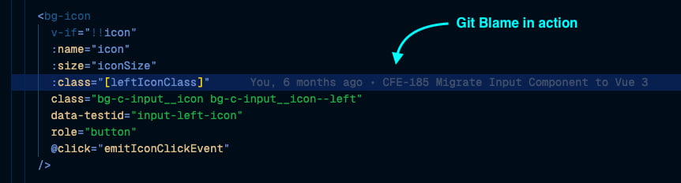

## Preface

How often do you as a programmer, find a single line or block of code that seems only the author and God knows why the code was written?

Of course, we can always ask the author. Sadly, it’s so common that the one who wrote them completely forgot or he/she might have left the company. One thing that helped me in such cases was looking at the Git Blame.

With Git Blame, we can see a Commit message from a particular line:

> Sometimes when Git Blame is not enough, I also could view the complete Commit history of a single file instead to see how the file changed over time.

## Caveats

One thing to note here is using Git Blame **won’t give you any good if the Commit message isn’t meaningful**. In the company where I worked, I always encourage my team to at least follow this commit format message:

"**ISSUE-XXX Descriptive Commit Message**"

`ISSUE-XXX` is the issue code and it can be a JIRA task code, GitHub Issue code, or whatever your team uses.

But why does putting the issue code become so important? That’s because everyone will be able to track the issue by referencing the issue code so they’ll get the information they need.

Most of the time, knowing the issue code from the commit message will lend us to the Issue detail and the Pull Request link.

1. An issue detail will always tell **WHAT** the problem that needs to be solved.
2. A Pull Request with a well-written description will tell **HOW** the problem is being solved.

Those two also could contain the PRD Link, Incident page Link, Design link, Screen recording, etc.

By following this practice, me and my team have better decision-making when facing legacy code since we know what and why the code exists in the first place. I’ve written a detailed article on the best practice of creating pull requests. [Click here to read](https://medium.com/mamitech/pull-request-principles-in-mamikos-ab6a7390aeac).

## Recap

In recap, Git Blame and commit history will help us to recall the legacy code information only if you and your team always:

1. Write a short & descriptive commit message.
2. Put the Issue Code in the commit message.
3. Write good issue detail.
4. Write good Pull Request description.
