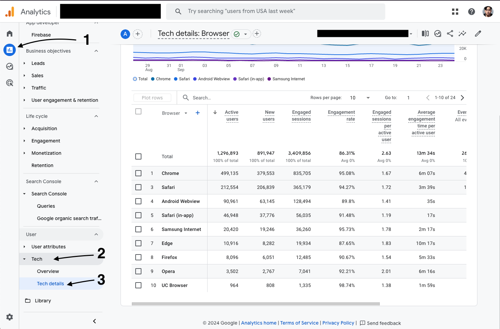
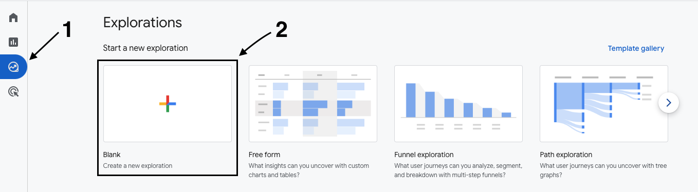
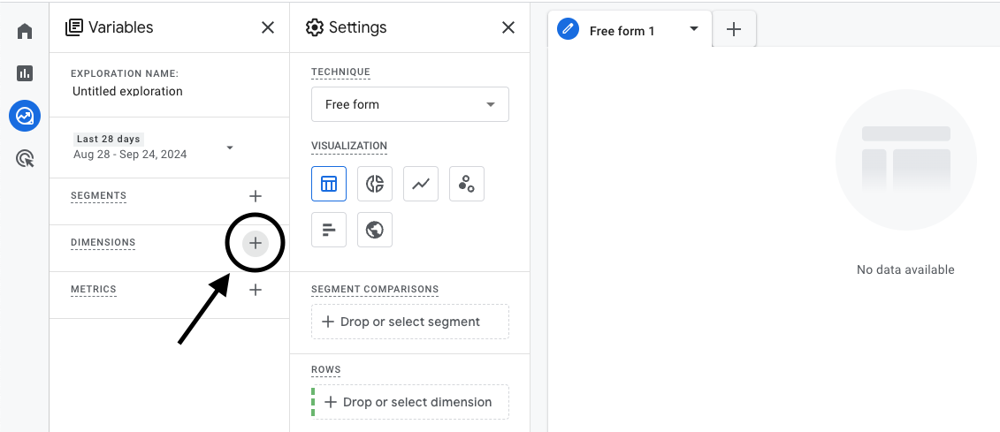
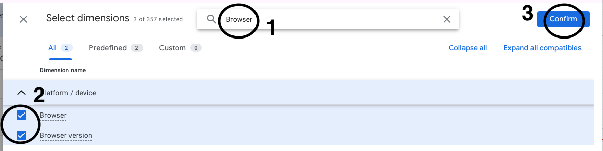
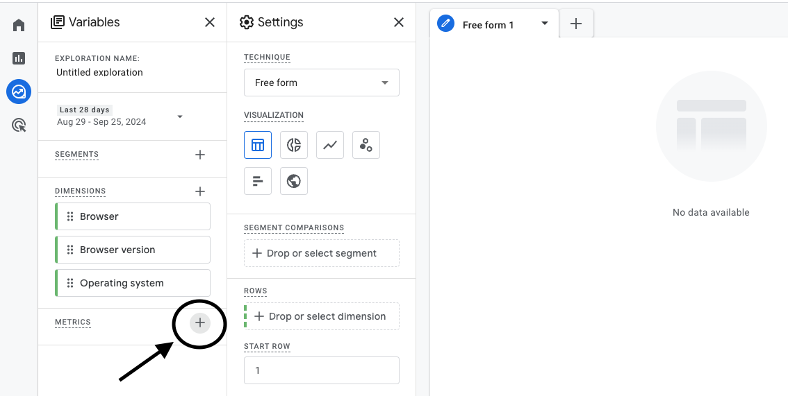
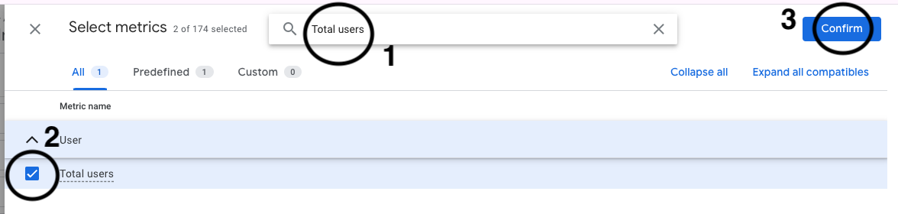
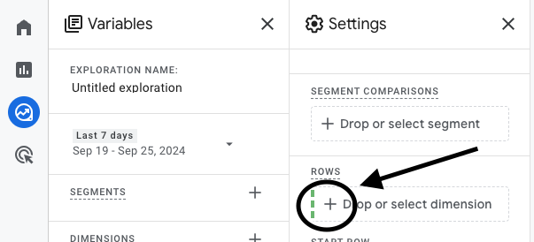
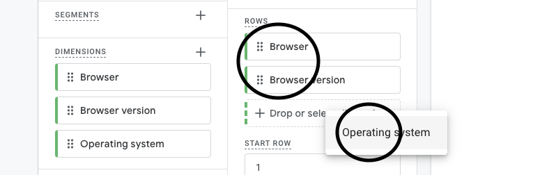
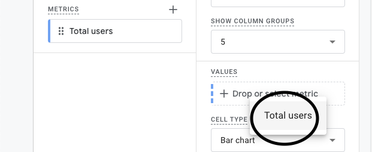
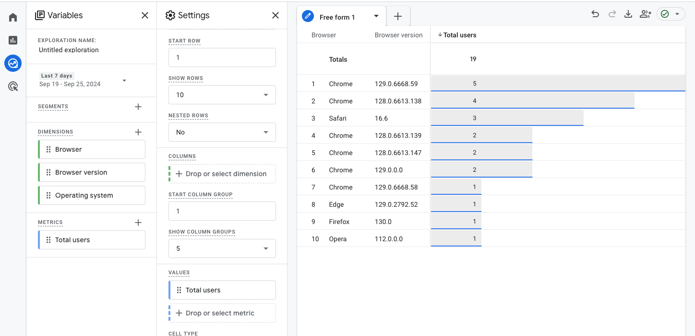

## Preface

In this article, I will show you how you can analyze your browsers’ visitors with Google Analytics 4.

To follow this article, I would assume you’ve installed Google Analytics to your site, if you haven’t, then you can follow this instruction → [[GA 4] Set up Analytics for a website](https://support.google.com/analytics/answer/9304153?hl=en#zippy=%2Cadd-the-google-tag-directly-to-your-web-pages).

## Analyzing Browser Vendor

Visitor’s browser vendor information could help us to decide the browser vendor we should focus on when developing our site. To access the data, open your [Google Analytics Dashboard](https://analytics.google.com), then go to “Reports” → “Tech” → “Tech Details” menu:

The report shows how many users with specific browsers had accessed our site within the specified date range. I’d suggest to filter the data for at least 90 days. Unfortunately, the report doesn’t provide information about the browser version. Thus, the report isn’t reliable enough.

## Analyzing Browser Versions

[Another way](https://stackoverflow.com/questions/68256046/browser-version-dimension-missing-in-ga4-api/68286131#68286131) to gather the user’s browser version data is via the Exploration Menu. We could only access the last 90 days’ data from this menu, but that’s enough.

### Step 1: Open the Exploration Menu

Open the “Explore” menu from the left sidebar, and then click on the “Create a new exploration” menu.

### Step 2: Open the Dimensions menu

Click on the “+” icon next to the “DIMENSIONS”. After you click it, a “Select dimensions” popup will appear.

### Step 3: Select the dimensions

Select the dimensions by searching and selecting the “Browser”, “Browser version”, and “Operating System” checkbox. After those three has been selected, click the “Confirm” button:

### Step 4: Open the “Metrics” menu

Click on the “+” icon next to the “METRICS”. After you click it, a “Select metrics” popup would be appeared.

### Step 5: Select the Metrics

Select the metrics by searching and selecting the “Total Users” checkbox. After that, click the “Confirm” button:

“Total users” would be enough in this case, you can repeat the above process and select the metrics you want to use in your report though.

### Step 6: Select the dimensions for the report

Click the "Drop or select dimension" button:

After that, make sure you choose “Browser”, “Browser version”, and “Operating System”:

### Step 7: Select the metrics for the report

The last thing to to is selecting the metrics for the report from the “Values” option:

### Step 8: Analyze the report

At this point, you should see your site’s visitor’s browser version report. You could customize the Dimensions, Metrics, and also the date range for your report:

## Conclusions

Analyzing your site visitor’s browser version should be done regularly. I’d suggest doing this at least quarterly.
