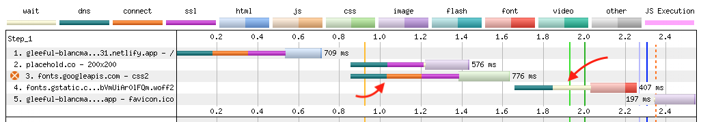
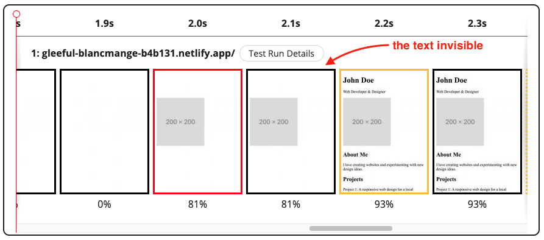
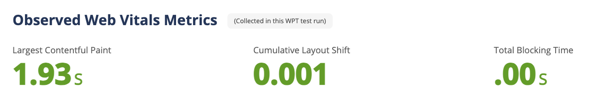

import Aside from "../../../components/Aside.astro";

## Introduction

Fonts play a crucial role in web design, it create a unique brand identity and
improve readability.

Many websites use custom fonts from external providers like Google Fonts because
it's simple and convenient. However, loading fonts from external providers can
impact negatively for our website.

In this article, I will show you how to optimize font loading to improve web
performance.

## The Cost of Fonts

Given this simple example:

```html {5,9} showLineNumbers startLineNumber=5
...
<head>
  <link
    rel="stylesheet"
    href="https://fonts.googleapis.com/css2?family=Roboto"
  />
  <style>
    body {
      font-family: "Roboto";
      font-weight: 400;
    }
  </style>
</head>
...
```

Even with just a simple page above could lead to several issues like:

- [Adds extra HTTP Requests](#adds-extra-http-requests)
- [Causing FOIT (Flash of Invisible Text)](#causing-flash-of-invisible-text-foit)
- [Causing FOUT (Flash of Unstyled Text)](#causing-flash-of-unstyled-text-fout)
- [Increasing Cumulative Layout Shift (CLS)](#increasing-cls-cumulative-layout-shift)

### Adds extra HTTP Requests

When you load font externally, it adds extra HTTP requests to your website. The
browser must wait to download the font files before rendering the text. This can
slow down the page loading speed.



### Causing Flash of Invisible Text (FOIT)

FOIT occurs when the browser still loading the font files. The text will be
invisible until the font files are fully loaded like the screenshot below:



### Causing Flash of Unstyled Text (FOUT)

FOUT occurs when the browser renders the text with a fallback font first, then
when the custom fonts are loaded, the text style will be re-rendered with the
new font.


This is really noticable when the custom font is significantly different from
the fallback font.

### Increasing CLS (Cumulative Layout Shift)

FOIT and FOUT are contributing to the Cumulative Layout Shift (CLS) score.
Impacting the overall web performance score.



<Aside>
  https://www.webpagetest.org/vitals.php?test=250316_BiDcRS_1F1&run=2
</Aside>

## Use System Fonts

If it's possible, consider to use system fonts instead of using the custom one
because browsers don't need to download any additional font resources online.

This method is what **I recommend for most websites** since it's simple, and can
matches with the user's current Operating System.

```html del={3-6} {9-20} showLineNumbers startLineNumber=5
...
<head>
  <link
    rel="stylesheet"
    href="https://fonts.googleapis.com/css2?family=Roboto"
  />
  <style>
    body {
      font-family:
        system-ui,
        -apple-system,
        BlinkMacSystemFont,
        "Segoe UI",
        Roboto,
        "Helvetica Neue",
        Arial,
        sans-serif,
        "Apple Color Emoji",
        "Segoe UI Emoji",
        "Noto Color Emoji";

      font-weight: 400;
    }
  </style>
</head>
...
```

<Aside variant="tip">
  Read more the detailed explanation from CSS-Tricks' article 👉 [System Font
  Stack](https://css-tricks.com/snippets/css/system-font-stack/)
</Aside>

## Custom Font Best Practices

If the system fonts are not an option, you can still optimize the custom fonts
by following these best practices:

### Use WOFF2 File Format

Make sure to load the WOFF2 format. It's a modern font format optimized for the
web. The silver bullet here is just ignore WOFF, TTF, OTF format if you don't
support old browsers like Internet Explorer.

Google Fonts already use this format by default and ignore other formats in
their CSS file:

```css title="https://fonts.googleapis.com/css2?family=Roboto"
@font-face {
  font-family: "Roboto";
  font-style: normal;
  font-weight: 400;
  src: url(https://fonts.gstatic.com/s/roboto/v47/KFOMCnqEu92Fr1ME7kSn66aGLdTylUAMQXC89YmC2DPNWubEbVmZiAr0klQmz24O0g.woff2)
    format("woff2");
}
...
```

### Use Self-Hosted Fonts

Instead of loading the font from Google Fonts, I'd recommend to download the
fonts locally, put to your site, and load them so the fonts can be downloaded
from the same domain.

This practice can eliminate the SSL, DNS, and Connection Process compared to the
external domains.

```css {5} title="style.css"
@font-face {
  font-family: "Roboto";
  font-style: normal;
  font-weight: 400;
  src: url(/fonts/roboto-regular.woff2) format("woff2");
}
...

```

<Aside>
  Google Fonts only provide the TTF format to download. You'll need to download
  them from other places. I recommend to get your WOFF2 fonts at
  [google-webfonts-helper](https://gwfh.mranftl.com/fonts) by [Mario
  Ranftl](https://mranftl.com/).
</Aside>

### Use font-display: swap

When defining the `@font-face` rule, make sure to also put the
`font-display: swap;` property to instruct the browser to use the fallback font
to display the text until the custom font has fully downloaded.

This ensure our site doesn't have the FOIT issue.

```css ins={5}
@font-face {
  font-family: "Roboto";
  font-style: normal;
  font-weight: 400;
  font-display: swap;
  src: url(/fonts/roboto-regular.woff2) format("woff2");
}
...

```

Putting this property to the font definition improves the user experience by
displaying the text immediately with the fallback font.

<div class="flex gap-2 not-prose my-4 flex-col md:flex-row">

  <div>


    <p class="text-center mt-2">Without font-display: swap</p>

  </div>

  <div>


    <p class="text-center mt-2">With font-display: swap 👍</p>

  </div>

</div>

### Load Only Necessary Weights and Styles

### Preload Important Above-the-fold Fonts

### Use System Fonts as Fallback

### Lazy Load Non-Essential Fonts

## Performance Comparison

## Conclusions
