Let's be honest—remote team building can feel forced. But here's the thing: the best teams aren't built in formal meetings. They're built in moments of shared laughter, friendly games, and the chaos of trying to draw a giraffe in 30 seconds.

I've been working remotely for years now, and I've seen how challenging it can be to maintain team spirit through a screen.

As tech professionals, we spend hours debugging code, reviewing pull requests, and solving complex problems. Sometimes, the best way to strengthen team dynamics is to step away from the keyboard and just... play.

I've tried many games with my team, and here are some games that have helped my remote team stay connected and engaged.

## Creative & Drawing

### Gartic.io

**Link:** [gartic.io](https://gartic.io)

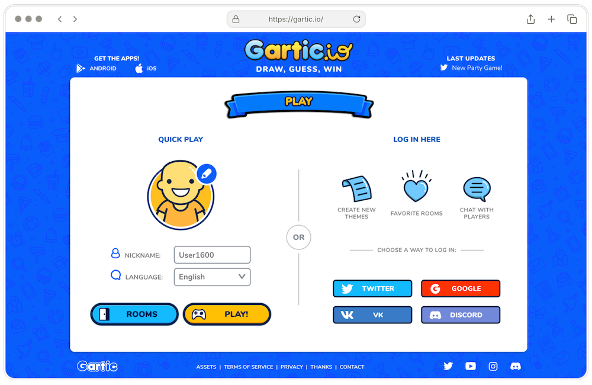

**Best for:** Quick 15-minute ice breakers, teams of 4-10 people

Players take turns drawing while others guess what masterpiece (or disaster) is being created. The twist? Everyone's artistic abilities—or lack thereof—are on full display. This makes for hilarious moments.

I still remember when one of my teammates tried to draw a "keyboard" and it looked more like a waffle. We laughed so hard that day.

### Garticphone

**Link:** [garticphone.com](https://garticphone.com)

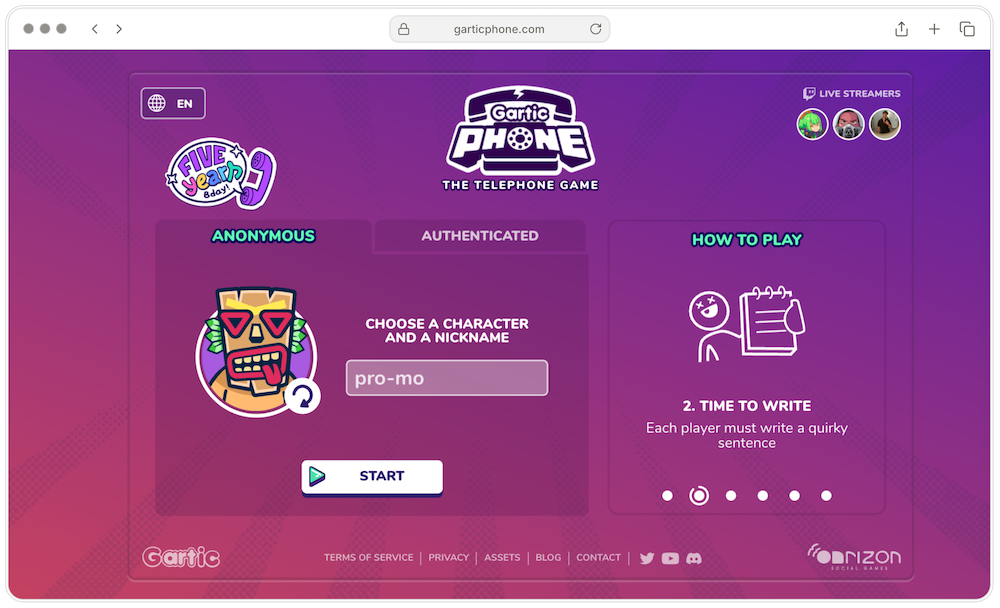

**Best for:** Teams that love creative chaos, 6-12 players

Remember the childhood game of Telephone where messages get hilariously distorted? Now imagine that with drawings. One person draws, the next person describes what they see, another draws that description, and so on. By the end, you'll wonder how "a cat with a laptop" became "an alien eating spaghetti."

### Make it Meme

**Link:** [makeitmeme.com](https://makeitmeme.com)

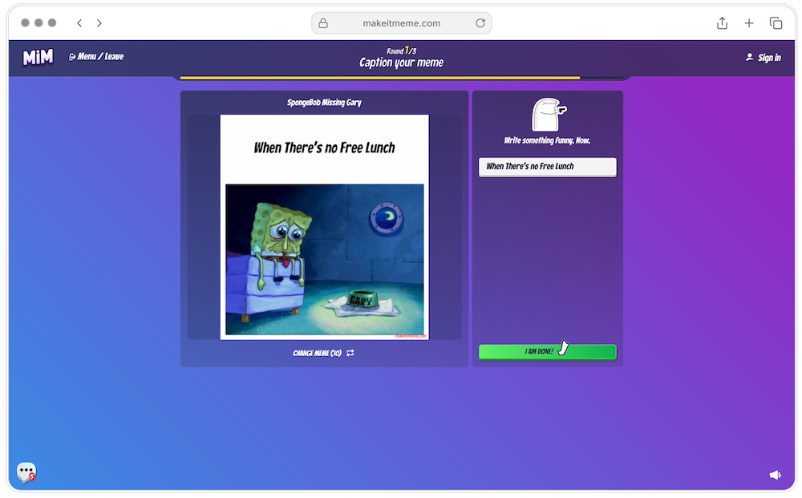

**Best for:** Teams with meme culture, quick engagement

Perfect for teams that communicate in GIFs and memes. Players compete to create the funniest meme based on prompts. It's like a hackathon, but for humor.

## Trivia & Knowledge

### SongTrivia2

**Link:** [songtrivia2.io](https://songtrivia2.io)

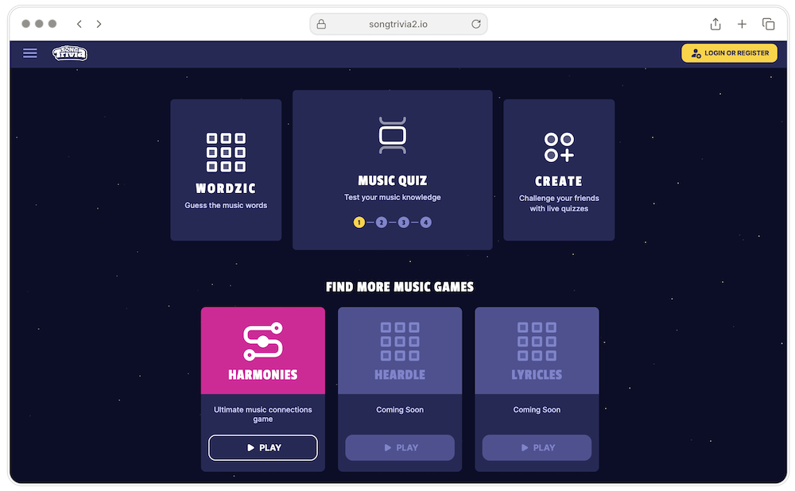

**Best for:** Diverse teams, music lovers, bonding over shared interests

Test your team's music knowledge in this multiplayer music trivia game. From classic rock to K-pop, everyone gets their moment to shine. It's surprising how much you can learn about teammates through their music tastes.

### Quiz

**Link:** [quiz.com](https://quiz.com)

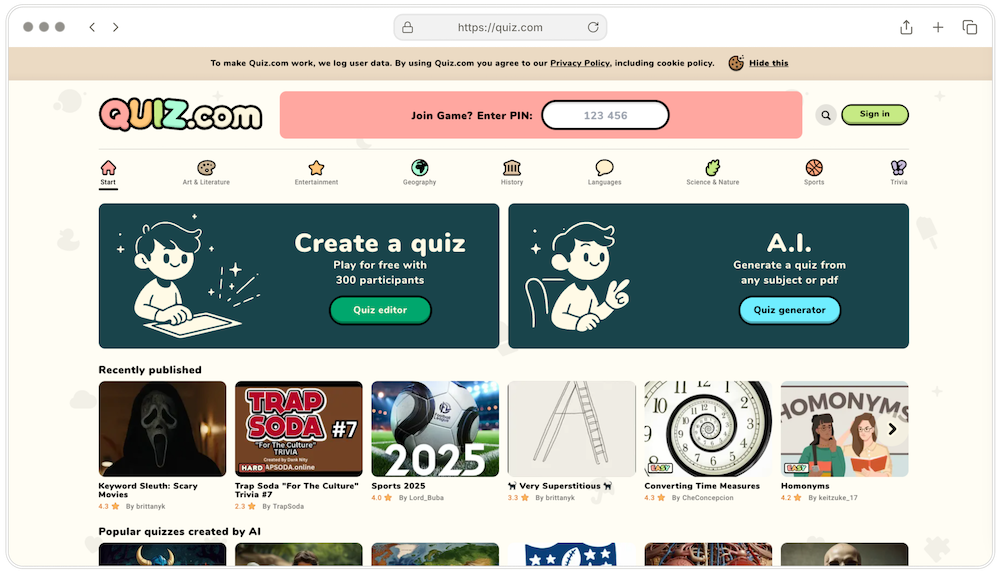

**Best for:** Educational team activities, custom content creation

Similar to Kahoot but with extra features like map-based questions and fun facts at each reveal. Great for creating custom team trivia that's more engaging than standard formats.

## Geography & Location

### City Guesser

**Link:** [cityguesser.eu/game](https://cityguesser.eu/game)

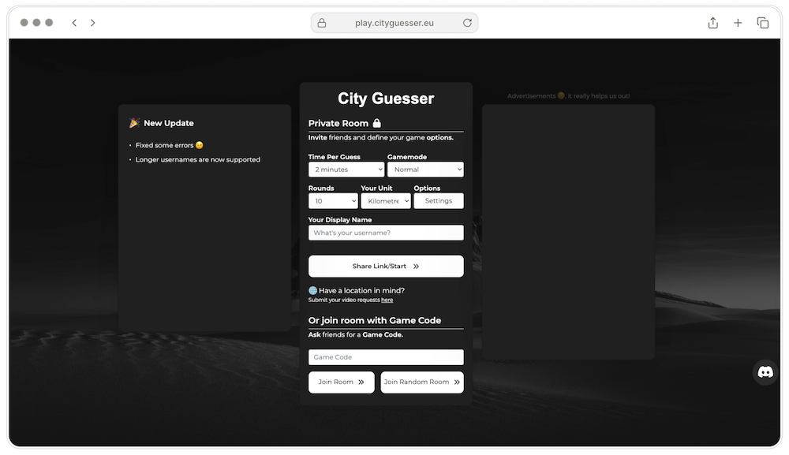

**Best for:** Global teams, geography enthusiasts

Dropped into a random city, players must figure out their location. It's like being a digital detective, using street signs, architecture, and environmental clues. Perfect for globally distributed teams to showcase their geographical knowledge.

### Geoguessr

**Link:** [geoguessr.com](https://geoguessr.com)

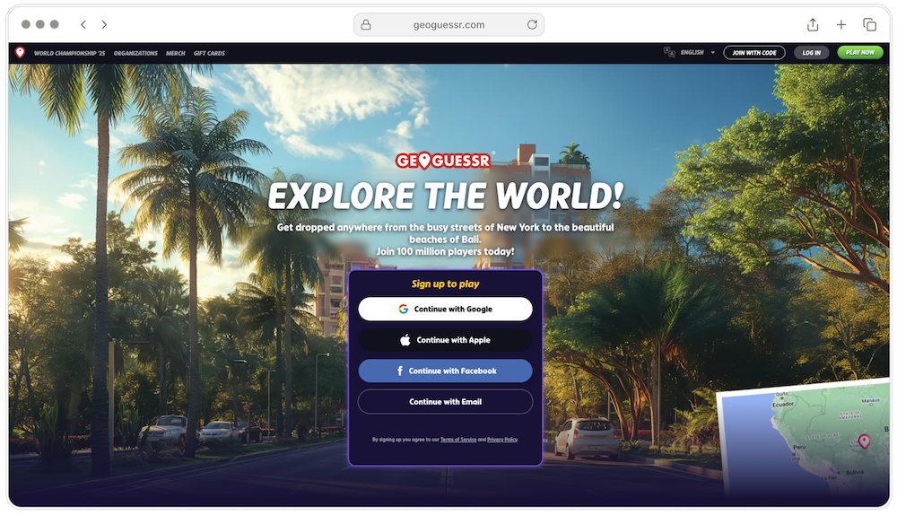

**Best for:** Competitive teams, longer gaming sessions

The OG of location-guessing games. Using Google Street View, players pinpoint their location on a world map. You'll discover beautiful places you never knew existed.

## Strategy

### Codenames

**Link:** [codenames.game](https://codenames.game)

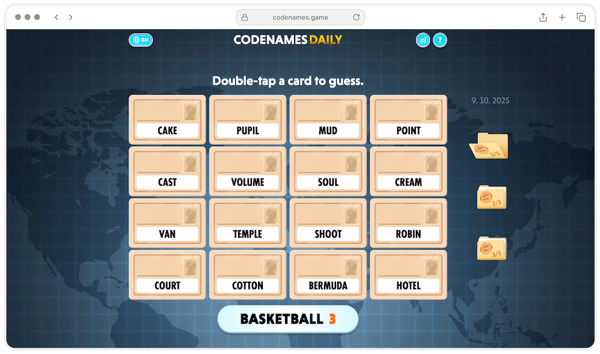

**Best for:** Teams of 4-8, developing communication skills

A word-based strategy game that requires communication, lateral thinking, and a bit of mind-reading. Teams compete to identify their agents using only one-word clues. It's like debugging code, but with words instead of syntax errors.

### Undercover

**Link:** [yanstarstudio.com](https://yanstarstudio.com)

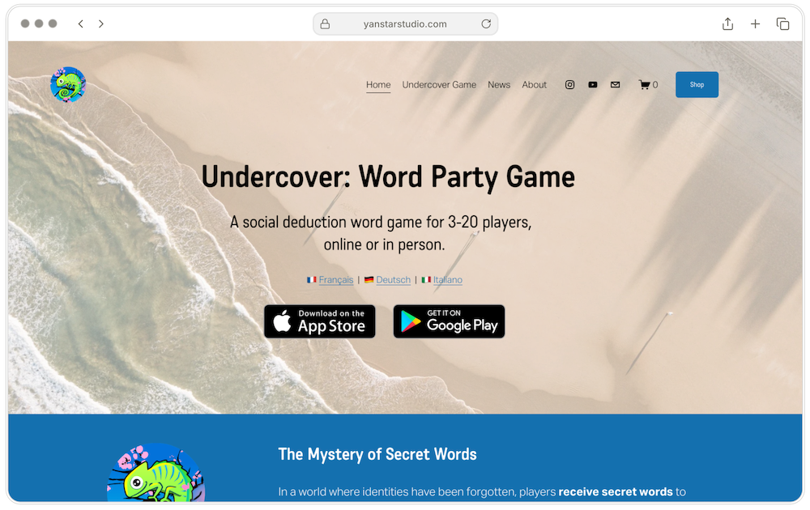

**Best for:** Large team events, social deduction fans

A wordplay social deduction game for 3-20 players set on a tropical island. Players receive secret words and must figure out who's the undercover agent through discussion and deduction.

## Word Games

### Stopots

**Link:** [stopots.com/en](https://stopots.com/en)

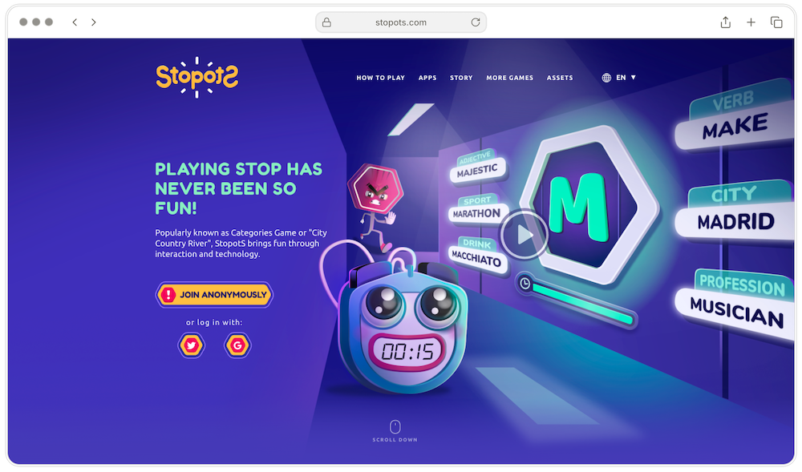

**Best for:** Fast-paced fun, cultural connection

The digital version of <a href="https://en.wikipedia.org/wiki/Scattergories" target="_blank">Scattergories</a>. Players race to fill categories with words starting with a random letter. For Indonesian teams, this might feel familiar as "ABC lima dasar" or "Sobyong."

### Gidd.io

**Link:** [gidd.io](https://gidd.io)

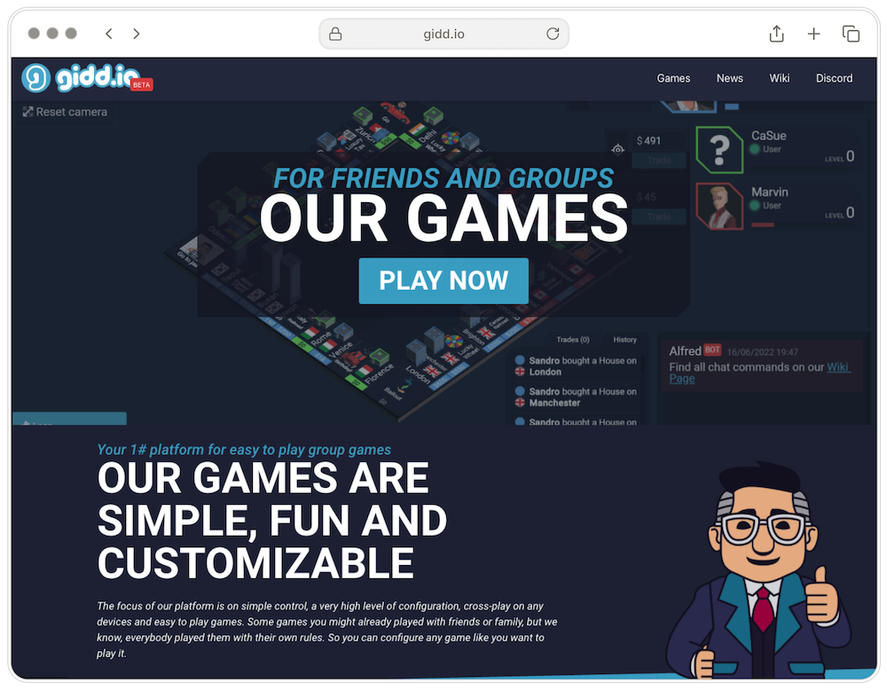

**Best for:** Variety seekers, customizable gaming experiences

A versatile platform for various party games that can accommodate different team sizes and preferences.

## Some Tips

1. **Keep it Short:** 15-30 minutes is the sweet spot. Any longer and it becomes a chore.
2. **Make it Optional:** Forced fun isn't fun. Let people opt-in naturally.
3. **Mix it Up:** Rotate games to keep things fresh and cater to different personalities.
4. **Test First:** Do a dry run before the actual session to avoid technical issues.
5. **Create Routine Schedules:** End of sprint, Friday afternoons, or monthly team days work best.

## Final Thoughts

Throughout my experience, I've noticed that teams who play together tend to communicate better. The informal setting helps break down barriers, and people feel more comfortable sharing ideas during actual work discussions.

I hope this article can help you find the right games for your remote team. Remember, the goal isn't just to play games—it's to build genuine connections that make work more enjoyable and productive.

Thank you for reading 👋
